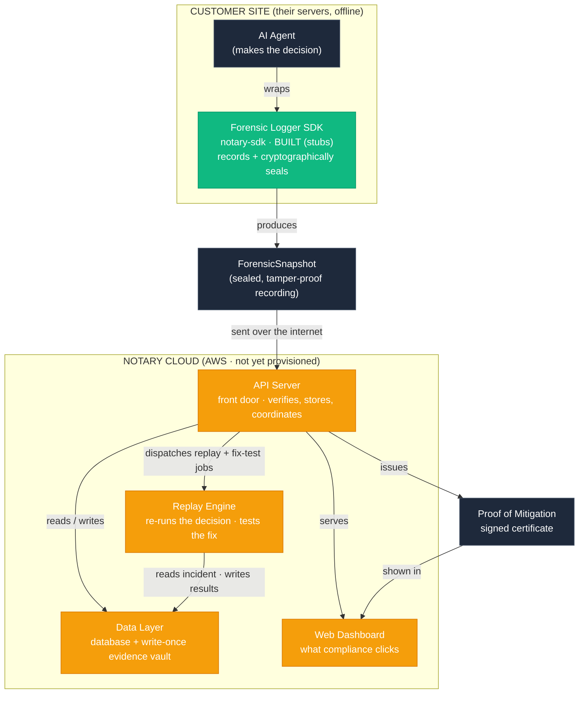

# Notary Platform Blueprints

**Revision:** Decision Evidence Protocol and Notary Sweep Engine integration, July 2026
**Source baseline:** `Test_Project_-_Copy_Combined_Blueprints-3.md`
**Protocol reference:** [Decision Evidence Protocol](../dep/README.md)

## Table of Contents

### Containers
- [Forensic Logger SDK](#forensic-logger-sdk)
- [API Server](#api-server)
- [Replay Engine](#replay-engine)
- [Data Layer](#data-layer)
- [Web Dashboard](#web-dashboard)
- [Sweep Worker](#sweep-worker)
- [System Overview (Plain-Language Map)](#system-overview-plain-language-map)

### Components
- [Cryptographic Evidence Sealing](#cryptographic-evidence-sealing)
- [Sandbox Orchestration and Replay](#sandbox-orchestration-and-replay)
- [Immutable Evidence Store](#immutable-evidence-store)
- [Execution Model](#execution-model)
- [Determinism Strategy](#determinism-strategy)

### Feature Blueprints
- [Forensic Agent Logger SDK](#forensic-agent-logger-sdk)
  - [Decision Evidence Graph Capture](#decision-evidence-graph-capture)
  - [Decision Context and Risk Metadata](#decision-context-and-risk-metadata)
- [Forensics Platform](#forensics-platform)
  - [Deterministic Replay](#deterministic-replay)
  - [Mutation Testing](#mutation-testing)
  - [Proof of Mitigation Certificates](#proof-of-mitigation-certificates)
  - [Compliance Reporting](#compliance-reporting)
  - [Branching and Experiments](#branching-and-experiments)
  - [Automated Incident Replay](#automated-incident-replay)
  - [Scenario Library](#scenario-library)
    - [Testing Playground](#testing-playground)
    - [Evidence Export](#evidence-export)
    - [Scenario Intelligence](#scenario-intelligence)
  - [Capture Rules and Decision Triggers](#capture-rules-and-decision-triggers)
    - [Manual Submission and Source-System Connectors](#manual-submission-and-source-system-connectors)
  - [Proof of Readiness](#proof-of-readiness)
  - [Data Lifecycle and Retention](#data-lifecycle-and-retention)
  - [Proof Claim Scope and Label Provenance](#proof-claim-scope-and-label-provenance)
- [GRC Integrations](#grc-integrations)
- [Web Dashboard](#web-dashboard)
- [Tiers and Entitlements](#tiers-and-entitlements)
- [Decision Evidence Discovery and Sweep](#decision-evidence-discovery-and-sweep)

---

# Containers

## Forensic Logger SDK

## Container Summary

The Forensic Logger SDK is an open source client library that runs inside the customer's own AI agent process. It transparently intercepts LLM calls, outbound API calls, and the agent's final decision, seals each element with HMAC-SHA256, chains them into a Merkle tree, and emits a `ForensicSnapshot`. It ships in two language implementations — Python (primary) and TypeScript — and operates fully offline with no dependency on Notary cloud infrastructure. It realizes the @Forensic Agent Logger SDK requirements.

## Infrastructure

The SDK is a library distributed via PyPI (Python) and NPM (TypeScript), not a deployed service. It executes in the host agent's runtime and adds no external runtime dependency: capture, sealing, Merkle chaining, and local verification all run in-process. Cryptography relies on the Python standard library (`hmac`, `hashlib`) and the Node crypto module; the Merkle tree is implemented in-house. Optional export targets (local filesystem, AWS S3, or the Notary #API Server ingestion endpoint) are the only outbound dependencies, and all are optional.

## Entry Points and Boundaries

Work enters the SDK through three interception paths rather than network endpoints:

* **LLM interception** — the #ForensicInterceptor wraps Anthropic and OpenAI client calls (Python decorators/context managers; TypeScript proxy objects/middleware) to capture prompt, response, and metadata.
* **Outbound API interception** — HTTP/REST client calls made by the agent are wrapped to capture request body, response body, and status.
* **Decision capture** — an explicit call records the final `AgentDecision` for the run.

The SDK exposes a local API surface for initialization (with a `SecretKey`), snapshot export (`ForensicSnapshot` as JSON or to a configured target), and local verification.

## System Contracts

### Key Contracts

* Requires a `SecretKey` at initialization; refuses to start capture without one.
* All sealing uses HMAC-SHA256; a change to any element or its ordering changes the `RootHash`.
* Local verification recomputes the `RootHash` and reports authenticity or tampering without any network call.
* Capture, sealing, chaining, and verification must succeed with no network connectivity.

### Integration Contracts

* Emits `ForensicSnapshot` (JSON) containing captured elements, per-element hashes, the Merkle chain, and the `RootHash`. This is the contract consumed by the #API Server incident ingestion endpoint.
* Every `ForensicSnapshot` carries an explicit `schema_version`. Because evidence must remain reproducible and verifiable years after capture, the snapshot format is versioned from the first release: the SDK stamps the version it produced, and the #API Server ingestion path must accept and correctly verify every previously emitted version rather than assuming the current shape. New fields are additive and older snapshots remain valid; a breaking format change increments the version and both the SDK and ingestion retain the ability to verify prior versions. Schema versioning is designed in from the start, not retrofitted, so a 2026 snapshot stays verifiable against a later platform.
* Export to S3 or Notary cloud is optional and configured by the integrator.

### Integration Boundaries

The SDK runs inside customer infrastructure and is the only component with access to the customer's `SecretKey` and raw agent data. It is the trust root of the system: because it is open source, regulators can audit the sealing logic directly. No raw data leaves the customer environment unless the integrator explicitly configures cloud export.

## Architecture Decision Records

### ADR-001: Distribute as an in-process library, not an agent or sidecar

**Context:** Forensic capture must be trustworthy and available even offline, and adoption depends on minimal integration friction for developers.

**Decision:** Ship the logger as an in-process open source library in Python and TypeScript that intercepts calls via language-native mechanisms, rather than as a sidecar process or network proxy.

**Consequences:** Zero network dependency and local verifiability build regulator trust and ease adoption; the cost is maintaining two language implementations and relying on language-specific interception mechanisms that must track upstream LLM/HTTP client changes.

## API Server

## Container Summary

The API Server is the primary cloud application for Notary's active release-gate product. It is a Python (FastAPI) service that receives `ForensicSnapshot` and `VerificationRecord` submissions, validates cryptographic integrity where the required key material is available, persists evidence and product workflow state, and orchestrates replay, mutation, Scenario Run, Readiness Check, and Release Gate work. It generates Proof of Mitigation and Proof of Readiness certificates; compliance reporting and GRC delivery remain planned consumers of those proof artifacts.

## Infrastructure

The API Server runs as a containerized service (Docker) on AWS ECS with auto-scaling. It depends on the #Data Layer for persistence: RDS PostgreSQL for Verification Record, Incident, Scenario, readiness, and status metadata; AWS S3 for the append-only immutable evidence log; and AWS Secrets Manager/KMS for organization HMAC keys in managed custody mode and Notary's asymmetric signing custody. It dispatches long-running replay and mutation work to the #Replay Engine over AWS SQS queues where asynchronous execution is enabled, and consumes `ReproducibilityResult` and `FixVerificationResult` outcomes to update incident, scenario, and readiness state.

## Entry Points and Boundaries

Work enters over authenticated HTTP/REST endpoints owned by the following components:

* #IncidentIngestionService — snapshot and Verification Record submission, integrity validation, Verification Record/Incident retrieval, and listing.
* #CustodyRecorder and #DefensibilityAssembler — custody event capture and incident-level defensibility summaries used by incident detail, certificates, readiness reports, and future compliance reports.
* #ReplayCoordinator — cassette-first replay request handling, sandbox escalation routing, result persistence, and incident status updates.
* #CertificateService — Proof of Mitigation certificate generation, signing, defensibility bundle assembly, and export.
* #ScenarioLibraryService and #ScenarioRunEvaluator — Scenario persistence, curation, and Scenario Runs against agent versions.
* #ReadinessPolicyService, #ReadinessCheckService, #ReadinessCertificateService, and #ReleaseGate — readiness policy, checks, certificates, and CI/CD pass/fail/error results.

The API Server dispatches replay and mutation jobs to the #Replay Engine and serves the #Web Dashboard and SDK cloud-export clients. Planned GRC and compliance-reporting endpoints may attach to the same proof artifacts later, but they are not part of the release-gate boundary.

## System Contracts

### Key Contracts

* All incident, scenario, certificate, and readiness endpoints require authentication; requests are scoped to the caller's organization and cross-organization access is denied.
* Ingestion recomputes and compares the `RootHash` where the HMAC key is available, then asymmetrically notarizes the verified `RootHash`; snapshots that fail integrity validation are rejected and never persisted as valid evidence.
* Writes to the immutable evidence log are append-only; modification and deletion are denied.
* Incident lifecycle status advances to the furthest completed step, recorded as append-only transition events in the immutable log.
* Replay is cassette-first by default; sandbox escalation is explicit and recorded as part of the proof context.
* Evidence lifecycle actions record custody events; artifacts are not presented as custody-complete when required custody events are missing.
* Proof of Mitigation and Proof of Readiness artifacts expose defensibility facts, claim scope, replay method, expected-outcome provenance, and known limitations without hiding missing inputs.

### Integration Contracts

* Accepts `ForensicSnapshot` and `VerificationRecord` submissions; returns an `Incident` or Verification Record status scoped to the organization.
* Dispatches `ReplayJob` and `MutationJob` messages to the #Replay Engine and consumes `ReproducibilityResult` / `FixVerificationResult` outcomes.
* Emits `ProofOfMitigationCertificate` and `ProofOfReadinessCertificate` artifacts (PDF/JSON where supported).
* Exposes Scenario Run and `ReleaseGate` contracts for pre-deployment release gating.
* Planned: `ComplianceReport`, `GrcIncidentRecord`, and evidence-attachment delivery for external GRC systems.

### Integration Boundaries

The API Server owns business logic, authorization, organization scoping, proof assembly, and orchestration. It never runs sandbox code itself — that is isolated in the #Replay Engine. It owns managed signing and key-custody references via Secrets Manager/KMS but delegates durable storage to the #Data Layer. GRC credentials and outbound evidence delivery are planned post-gate integrations rather than active release-gate dependencies.

## Architecture Decision Records

### ADR-001: Python (FastAPI) for the API Server

**Context:** The team needs a single backend stack that can share language and validation patterns with the primary SDK while supporting the proof and release-gate workflow.

**Decision:** Build the API Server in Python with FastAPI, keeping language parity with the primary SDK implementation and the in-house cryptographic sealing logic.

**Consequences:** Shared Python code and cryptographic primitives reduce duplication and review surface, and hiring/onboarding is simpler. The trade-off is lower raw throughput than Go; if replay or ingestion volume demands it, the compute-heavy #Replay Engine can scale independently.

### ADR-002: Separate replay execution into a dedicated container

**Context:** Replay and mutation testing may execute customer-referenced code or provision external sandboxes — untrusted, resource-intensive, and long-running work that should not run in the request-handling API process.

**Decision:** Dispatch replay and mutation jobs from the API Server to a dedicated #Replay Engine container over a job/result contract; use AWS SQS queues where asynchronous execution is enabled.

**Consequences:** Isolates untrusted execution and lets replay scale independently of the API tier. The trade-off is the added operational surface of queue/result handling and idempotency across the two containers.

### ADR-003: Treat Release Gate as the active platform boundary

**Context:** The platform vision includes GRC delivery, compliance reporting, enterprise inventory, and operational trust tooling, but building those before the release gate would dilute the proof loop.

**Decision:** Make the active API boundary run through Scenario Runs, Proof of Readiness, and `ReleaseGate`. Keep compliance reporting and GRC delivery as planned consumers of proof artifacts.

**Consequences:** The near-term API stays focused on the differentiating workflow: capture, replay, verify, scenario, and gate. Enterprise integrations remain easier to add later because proof artifacts and defensibility records are already structured.

## Replay Engine

## Container Summary

The Replay Engine is the execution boundary for cassette-first deterministic replay, sandbox escalation when live provider validation is required, and fix verification with customer-supplied changes applied. It may run as a containerized worker for asynchronous workloads or synchronously behind the #API Server in the current release-gate prototype, but its contract is the same: return reproducibility and fix-verification results with the replay method and known limitations attached.

## Infrastructure

The Replay Engine runs as containerized workers (Docker) on AWS ECS with auto-scaling to handle concurrent replays. For asynchronous deployments, workers consume jobs from an AWS SQS job queue and publish outcomes to an SQS results queue; the current release-gate prototype may execute the same contract synchronously to reduce infrastructure before concurrent load exists. Cassette replay reads sealed `ResponseCassette` evidence from the #Data Layer and executes without contacting the provider. Sandbox escalation executes in isolated container instances and provisions clean provider sandboxes, such as Stripe test mode, GitHub test org, or Salesforce sandbox, only when the cassette cannot answer a changed call or customer-approved live validation is required. For mutation testing, the worker checks out customer code by git branch and commit, then re-runs the captured scenario against the expected outcome.

## Entry Points and Boundaries

Work enters through the replay job contract dispatched by the #API Server. In asynchronous deployments those jobs are consumed from AWS SQS; in the current prototype the same contract may be executed synchronously:

* `ReplayJob` — re-execute an incident from its sealed `ResponseCassette` by default, escalate to a `SandboxEnvironment` only when required or requested, compare `ReplayResponse` to `OriginalResponse`, and return a `ReproducibilityResult`. Owned by #DeterministicReplayRunner and #SandboxOrchestrator.
* `MutationJob` — check out the `FixReference` code, re-run the captured scenario with modified agent logic against the `ExpectedCorrectBehavior`, use cassette responses by default with sandbox escalation where required, and return a `FixVerificationResult`. Owned by #MutationTestRunner.

Outcomes are published to the SQS results queue for the #API Server to consume.

## System Contracts

### Key Contracts

* Every replay and mutation run uses the sealed `ResponseCassette` as the default external-response source.
* Sandbox escalation is explicit and recorded; sandbox runs are isolated from production and from one another.
* Sandboxes are provisioned clean and seeded with state equivalent to the incident when live validation is required.
* A mutation job is only accepted for an incident already marked reproducible.
* Failed, incomplete, non-deterministic, unsupported-live-validation, and partial runs are recorded as such rather than silently dropped.
* Every result identifies the replay method and limitations so downstream proof artifacts do not overclaim.

### Integration Contracts

* Consumes `ReplayJob` and `MutationJob` from the #API Server.
* Produces `ReproducibilityResult` and `FixVerificationResult`, persisted via the #Data Layer and associated with the `Incident`.
* Reads sealed `ResponseCassette` evidence from the #Data Layer.
* Integrates with external sandbox providers only for escalation; supported provider coverage expands through adapters rather than changing the replay contract.

### Integration Boundaries

The Replay Engine is the only container that executes customer-referenced code and talks to external provider sandboxes, keeping that risk isolated from the #API Server request path. It owns no business logic or authorization — it executes jobs and returns results. Provider sandbox credentials and customer git access are scoped to this container, and cassette replay must not require live provider credentials.

## Architecture Decision Records

### ADR-001: Cassette-first replay with real provider sandbox escalation

**Context:** Replay evidence must remain reproducible years later, even if a provider changes or retires its sandbox. But fixes may introduce calls not present in the original recording, and some customers may require live confirmation against a provider-controlled test mode.

**Decision:** Use the sealed `ResponseCassette` as the default source for external responses. Escalate to real provider sandboxes only when the cassette cannot answer a changed call or when customer-approved live validation is required.

**Consequences:** Default replay is durable and independent of provider availability. Sandbox validation remains available for stronger live-confirmation claims, but proof artifacts must distinguish cassette-backed replay from sandbox-backed validation.

### ADR-002: Isolated container per sandbox or mutation run

**Context:** Runs that execute customer-referenced code or contact provider sandboxes must not interfere with one another under concurrency.

**Decision:** Execute each sandbox-escalated replay and mutation run in its own isolated container instance on ECS with auto-scaling.

**Consequences:** Strong isolation and horizontal scalability for concurrent investigations; higher per-run provisioning overhead and infrastructure cost for sandbox-backed paths. Cassette-only replay can remain lighter because it does not contact external providers.

## Data Layer

## Container Summary

The Data Layer is the persistence and messaging tier for the Forensics Platform. It combines three AWS managed stores that together guarantee tamper-proof, auditable retention of forensic evidence — RDS PostgreSQL for incident metadata and lifecycle state, S3 for the append-only immutable evidence log, and Secrets Manager for keys and credentials — plus AWS SQS queues that carry asynchronous jobs between the #API Server and #Replay Engine. It is not a service the team writes business logic into; it is the managed infrastructure the #API Server and #Replay Engine depend on.

## Infrastructure

* **RDS PostgreSQL** — relational store for `Incident` metadata, replay/mutation result records, and GRC connection configuration. It holds a queryable projection of `IncidentStatus` and its history rebuilt from the authoritative status-transition events in the S3 immutable log, not the authoritative copy.
* **AWS S3** — object store for the immutable evidence log: `ForensicSnapshot` payloads, `NotarizationSignature`s, incident status-transition events, replay logs, mutation test evidence, generated certificates, and reports. Configured with object versioning and write-once semantics to enforce append-only behavior.
* **AWS Secrets Manager** — secure storage for organization HMAC `SecretKey`s in managed custody mode (with versioning for rotation; absent when a customer uses BYOK and withholds the key), Notary's asymmetric notarization/certificate signing key pair (ECDSA/RSA), plus GRC system credentials and external API/sandbox credentials.
* **AWS SQS** — managed message queues carrying `ReplayJob`/`MutationJob` from the #API Server to the #Replay Engine and returning `ReproducibilityResult`/`FixVerificationResult`. This is transport, not durable evidence; all evidence is persisted to S3/PostgreSQL.

## Entry Points and Boundaries

The Data Layer exposes no application endpoints. Access is via database connections, AWS SDK calls, and SQS queue operations from the #API Server (all stores and queues) and the #Replay Engine (reads incident data, consumes jobs, publishes results). All access is server-side within the platform's private network.

## System Contracts

### Key Contracts

* The S3 evidence log is append-only: objects are written once and never modified or deleted; deletion/overwrite requests are denied by bucket policy and object lock.
* Evidence is retained so that any incident remains retrievable and independently verifiable at any later time.
* Credentials and keys stored in Secrets Manager are never returned in application retrieval responses. In managed mode, organization HMAC keys are resolved only server-side; in BYOK mode a withheld key is never transmitted to Notary. The asymmetric private signing key never leaves the server; only the public key is exposed.
* Incident status history is authoritative as append-only transition events in the S3 immutable log; the PostgreSQL status projection is derived and rebuildable from those events and is never the source of truth.

### Integration Contracts

* Persists `ForensicSnapshot`, `NotarizationSignature`, status-transition events, `ProofOfMitigationCertificate`, `ComplianceReport`, replay logs, and mutation evidence to S3.
* Persists `Incident` metadata, the derived `IncidentStatus` projection, `ReproducibilityResult`, `FixVerificationResult`, and `GrcConnection` metadata to PostgreSQL.

### Integration Boundaries

The Data Layer owns durability and immutability guarantees; it does not enforce application authorization (that is the #API Server's responsibility). The separation between mutable metadata (PostgreSQL) and immutable evidence (S3) is the core boundary: evidence integrity is enforced at the storage layer, independent of application code.

## Architecture Decision Records

### ADR-001: Split mutable metadata from immutable evidence

**Context:** Incident lifecycle state changes over time, while forensic evidence must be provably unaltered for audits and litigation.

**Decision:** Store mutable metadata and lifecycle state in RDS PostgreSQL and store all forensic evidence in S3 with versioning and write-once object lock enforcing append-only semantics.

**Consequences:** Storage-level immutability makes the chain of custody defensible independent of application code, while relational metadata stays flexible and queryable. The trade-off is coordinating two stores and ensuring references between them remain consistent.

### ADR-002: Version keys so rotation never breaks verification of old evidence

**Context:** Organization HMAC `SecretKey`s must be rotatable (a security requirement, and mandatory in some regimes), but a `ForensicSnapshot` sealed under an earlier key must remain verifiable years later. If rotation replaced the key in place, every record sealed under the prior key would become unverifiable — silently indistinguishable from tampering. BYOK sharpens this: in managed custody the platform holds prior key versions, but when a customer withholds a rotated key the server cannot recompute the `RootHash` for records sealed under any version it no longer holds.

**Decision:** Store keys in AWS Secrets Manager with explicit versioning and retain all prior key versions for as long as any evidence sealed under them is retained. Each `ForensicSnapshot` records which key version sealed it, and verification resolves the matching version rather than assuming the current key. Rotation issues a new version for future sealing and never invalidates prior versions. In BYOK mode, integrity of records under a withheld version falls back to the asymmetric notarization signature (consistent with the Cryptographic Evidence Sealing ADRs), and this fallback is surfaced explicitly rather than reported as a verification failure.

**Consequences:** Key rotation and long-horizon verifiability coexist: a 2026 record stays verifiable after later rotations. The trade-offs are that prior key versions cannot be destroyed while their evidence is retained — which interacts directly with the crypto-shredding option under consideration in the @Data Lifecycle and Retention feature, where destroying key material is the erasure mechanism — and that BYOK customers must understand that withholding a key version shifts those records to signature-based integrity rather than full server-side recomputation.

## Web Dashboard

## Container Summary

The Web Dashboard is the browser-based interface users use to operate Notary's active release-gate workflow. It lets users authenticate, set up SDK capture, review Verification Records, inspect Decision Evidence Graph elements, run replay and fix verification, issue Proof of Mitigation, promote Scenarios, run Scenario sets, manage Readiness Policies, and trigger Release Gate checks. It is a thin client over the #API Server and holds no forensic business logic or durable evidence itself.

## Infrastructure

The current deployed dashboard is a static HTML/CSS/JavaScript single-page app served by the #API Server at `/app/`, with same-origin calls to authenticated `/v1` API endpoints. This pragmatic delivery keeps the demo and design-partner surface simple while the longer-term frontend target can still evolve into a React/TypeScript app. Authentication and authorization are enforced by the #API Server; the dashboard holds only the active token and environment selection in browser state.

## Entry Points and Boundaries

Work enters through the browser UI, which calls the #API Server's authenticated REST endpoints. Primary surfaces:

* Setup and SDK onboarding, including Python SDK install instructions, copyable snippets, API token guidance, and demo/local mode distinction.
* Verification Record list and detail views showing source, replayability, captured events, labels, missing prerequisites, custody, and evidence.
* Replay, mutation test, Proof of Mitigation, and signature-verification actions with server-provided eligibility reasons.
* Scenario Candidate, Scenario Library, and Scenario Run surfaces.
* Readiness Policy, Readiness Check, Release Gate result, and copyable CI/CD command surfaces.
* Planned Governance and Settings areas that must distinguish configured capability from roadmap items.

## System Contracts

### Key Contracts

* The dashboard renders only data returned by the #API Server or local UI settings; it enforces no authorization locally and must handle missing/invalid tokens by prompting for authentication.
* All product data shown is scoped to the user's organization by the #API Server.
* Every primary visible action either calls a working #API Server endpoint or is disabled with the server-provided reason.
* Demo data is visibly marked as demo data and must flow through the same APIs and persisted objects as non-demo records.
* The dashboard must show loading, empty, error, blocked, pass, fail, and system-error states distinctly.

### Integration Contracts

* Consumes the #API Server REST API for `VerificationRecord` retrieval/listing, action eligibility, `ReplayRun`, `MutationTest`, `ProofCertificate`, `ScenarioCandidate`, `Scenario`, `ScenarioRun`, `ReadinessPolicy`, `ReadinessCheck`, and `ReleaseGateResult` operations.
* Uses same-origin `/v1` API calls and copies command examples that match the deployed API base URL and current SDK install path.

### Integration Boundaries

The dashboard owns presentation, navigation, copy-to-clipboard affordances, and user interaction only. All persistence, orchestration, cryptographic operations, proof eligibility, action eligibility, and authorization live behind the #API Server boundary. No forensic evidence is stored client-side beyond transient display.

## Architecture Decision Records

### ADR-001: Static thin client for the active release-gate prototype

**Context:** The immediate need is a reliable customer-demo and design-partner surface for the release-gate workflow, not a full frontend platform migration.

**Decision:** Serve a static HTML/CSS/JavaScript single-page app from the #API Server for the active release-gate prototype, with every meaningful action backed by #API Server endpoints. Keep React/TypeScript as a future implementation option rather than a prerequisite for demonstrating product depth.

**Consequences:** The team can ship and test the product workflow quickly with no separate frontend build or CORS boundary. The trade-off is that long-term dashboard growth will eventually need a stronger frontend architecture and design system.

### ADR-002: Product workflow surface, not observability dashboard

**Context:** A dashboard that looks like logs or APM would put Notary in the wrong category and weaken the proof story. Users need to understand the path from captured decision to replay, fix verification, Scenario, readiness, and Release Gate.

**Decision:** Present the dashboard around product workflow objects and actions: Verification Records, replayability, proof state, Scenario Candidates, Scenario Runs, Readiness Checks, Release Gate results, claim scope, and known limitations. Avoid real-time monitoring, alerting, and live performance dashboards.

**Consequences:** The UI reinforces Notary's differentiation as a proof and recurrence-prevention system. The trade-off is that operational monitoring remains delegated to observability tools, which is the intended boundary.

## System Overview (Plain-Language Map)

## Purpose

This is a plain-language map of the whole Notary system: what each piece is, what it does, where it runs, and how a decision flows through it. It is written for someone who is new to the codebase. Detailed technical contracts live in the individual container and component blueprints; this document exists to make the big picture understandable at a glance.

## The System at a Glance

Notary has two halves. One half runs on the **customer's own site** (the open-source SDK, embedded in their AI agent). The other half runs in **Notary's cloud on AWS** (the platform that receives, replays, and certifies evidence). A sealed recording travels from the customer's site to the cloud, gets replayed and fix-tested, and comes back as a signed certificate.

## What Each Piece Is (Plain English)

* **Forensic Logger SDK (`notary-sdk`)** — a small open-source library the customer installs inside their AI agent. It records every LLM call, API call, and decision, and seals each one cryptographically so it cannot be faked or altered. Runs on the customer's site, offline. *(Think: a tamper-proof security camera bolted onto their agent.)*
* **ForensicSnapshot** — the sealed recording the SDK produces (the prompt, the API responses, the decision, plus the cryptographic seals). *(Think: the footage, in a locked evidence bag.)*
* **API Server** — the cloud front door. Receives snapshots, checks they are untampered, stores them, and coordinates replay, fix-testing, and certificate generation. *(Think: the front desk and case manager at a forensics lab.)*
* **Replay Engine** — re-runs the recorded decision to reproduce the failure, and re-runs it again with a developer's fix to prove the fix works. *(Think: the lab bench where experiments are re-run.)*
* **Data Layer** — storage: a database for incident metadata, plus a write-once "evidence vault" that can never be edited or deleted. *(Think: the evidence locker.)*
* **Web Dashboard** — the screen a compliance officer uses to view incidents, trigger replays, and download certificates. *(Think: the case dashboard.)*

## How a Decision Flows Through the System

1. The customer's agent makes a decision (e.g. denies a loan).
2. The **SDK** records and seals it into a **ForensicSnapshot** — on the customer's own site.
3. The snapshot is sent to the **API Server** in the cloud, which verifies it was not tampered with and stores it in the **Data Layer** evidence vault.
4. The **API Server** asks the **Replay Engine** to re-run the decision and reproduce the failure.
5. A developer proposes a fix; the **Replay Engine** re-runs the decision with the fix and confirms the outcome changed.
6. The **API Server** issues a signed **Proof of Mitigation certificate**, visible and downloadable in the **Web Dashboard**.

## Build Status (as of now)

* **notary-sdk repo** — created and connected; module structure is in place as stubs (the code logic is written work order by work order).
* **notary-platform repo** — scaffolded (structure exists; logic not yet written).
* **AWS** — not yet provisioned; only needed for the cloud platform, not for the SDK.
* The SDK cryptographic core is the next code to build and needs only Python locally — no cloud.

## System Diagram



## How to Read the Diagram

* **Green** = built (the SDK, in stub form).
* **Amber** = scaffolded but not yet implemented (the cloud platform pieces).
* **Dark** = data or external things that flow through, not code you build (the agent, the snapshot, the certificate).
* **Top box** = runs on the customer's site. **Bottom box** = runs in your AWS cloud. The single arrow between them (snapshot → API Server) is the only thing that crosses from the customer to you — and it carries sealed evidence, nothing raw leaves unless the customer configures it.

# Components

## Cryptographic Evidence Sealing

## Capability Summary

Cryptographic Evidence Sealing turns raw captured data into tamper-evident, independently verifiable evidence. It operates in three layers. The **capture-integrity layer** seals each captured element with HMAC-SHA256, chains the per-element hashes into a Merkle tree to produce a single `RootHash`, and verifies integrity by recomputing that root — used by the #Forensic Logger SDK at capture time and by the #API Server on ingestion. The **verifiability layer** applies an asymmetric signature (ECDSA or RSA) over the ingested `RootHash` and over issued certificates, so any third party — a regulator or court — can verify authenticity with Notary's published public key without holding any secret. The **defensibility layer** records custody events and assembles the verification facts a recipient needs to evaluate custody, integrity, reproducibility, signing, tool versions, and known limitations. HMAC answers "was this tampered with?"; the asymmetric signature answers "can an outsider prove it independently?"; the defensibility record answers "is the evidence package complete enough to rely on?".

## Core Components

### Sealing and Chaining

```component
name: ElementSealer
container: Forensic Logger SDK, API Server
responsibilities:
	- Compute HMAC-SHA256 of a `CapturedElement` using the `SecretKey`
	- Produce one deterministic hash per element (prompt, response, request, decision)
	- Use SHA256 as the hashing algorithm for all seals
```

```component
name: MerkleChainBuilder
container: Forensic Logger SDK, API Server
responsibilities:
	- Combine per-element hashes into intermediate hashes and a single `RootHash`
	- Guarantee that any element change or reordering yields a different `RootHash`
	- Represent the entire `ForensicSnapshot` in one `RootHash`
```

The #MerkleChainBuilder consumes the per-element hashes produced by the #ElementSealer and folds them into the `RootHash`. The ordering of inputs is significant by design, so the builder fixes a canonical element order to make the `RootHash` reproducible for identical snapshots.

### Verification and Signing

```component
name: IntegrityVerifier
container: Forensic Logger SDK, API Server
responsibilities:
	- Recompute the `RootHash` from a `ForensicSnapshot` and compare to the stored value
	- Report authenticity when hashes match and tampering when they do not
	- Operate with no network dependency (used for local verification in the SDK)
```

```component
name: CertificateSigner
container: API Server
responsibilities:
	- Apply an asymmetric `CertificateSignature` (ECDSA or RSA, per deployment) to a generated `ProofOfMitigationCertificate`
	- Verify a certificate's signature with the published public key and detect post-signing alteration
	- Sign using Notary's private notarization key; never require a customer secret to verify
```

The #IntegrityVerifier reuses the #ElementSealer and #MerkleChainBuilder to recompute hashes; it is the read-side counterpart to sealing. The #CertificateSigner belongs to the verifiability layer: rather than reusing the symmetric HMAC key, it signs with an asymmetric key so a certificate's authenticity can be proven by anyone holding only the public key.

### Notarization and Key Custody

```component
name: EvidenceNotarizer
container: API Server
responsibilities:
	- On successful ingestion, asymmetrically sign the verified `RootHash` to produce a publicly verifiable `NotarizationSignature`
	- Support ECDSA and RSA, selected per deployment
	- Expose the public key and signature so regulators can verify evidence independently of Notary
```

```component
name: SealingKeyResolver
container: API Server, Forensic Logger SDK
responsibilities:
	- Resolve the HMAC `SecretKey` for an organization under a hybrid custody model
	- In BYOK mode, use the customer-supplied key; the customer may withhold it from Notary and verify locally
	- In managed mode (default), provision and store a per-organization key in AWS Secrets Manager (owned by the #Data Layer) with versioning for rotation
	- Record which key version sealed each `ForensicSnapshot` so rotation preserves historical verifiability
```

The #EvidenceNotarizer decouples third-party verifiability from the HMAC key entirely: even in BYOK mode where Notary never sees the customer's symmetric key, the asymmetric `NotarizationSignature` still lets a regulator verify the evidence. The #SealingKeyResolver encapsulates the hybrid custody decision so the #ElementSealer and #IntegrityVerifier need not know whether a key is customer-held or Notary-managed. When a snapshot is sealed in BYOK mode, server-side #IntegrityVerifier recomputation is only possible if the customer shares the key; otherwise integrity is verified locally by the customer while Notary relies on the `NotarizationSignature` for its own chain of custody.

### Defensibility Records

```component
name: CustodyRecorder
container: API Server
responsibilities:
	- Record a `CustodyEvent` for ingestion, integrity validation, replay, mutation testing, certificate generation, report generation, and export actions
	- Associate each custody entry with the acting user or system component, event time, affected `Incident`, action, and resulting evidence artifact or workflow state
	- Mark an evidence lifecycle action incomplete when its required custody entry cannot be recorded
```

```component
name: DefensibilityAssembler
container: API Server
responsibilities:
	- Assemble a `DefensibilityRecord` for an `Incident` from custody events, integrity verification, notarization, replay, mutation, signing, export, and tool-version inputs
	- Identify missing inputs and known limitations instead of producing a false submission-ready verdict
	- Provide the defensibility facts consumed by `ProofOfMitigationCertificate`, `ComplianceReport`, and dashboard incident detail responses
```

The #CustodyRecorder writes the chronological evidence-handling facts, while the #DefensibilityAssembler reads those facts and combines them with cryptographic and workflow outcomes. This separates the raw chain of custody from the derived submission-readiness view: missing custody events remain visible rather than being hidden behind a single score.

```model
name: CustodyEvent
store: S3
description: Append-only record of one evidence lifecycle action
fields:
	- incident_id: string
	- actor_id: string
	- actor_type: enum (user, system_component)
	- event_time: datetime
	- action: enum (ingested, integrity_validated, replay_started, replay_completed, mutation_started, mutation_completed, certificate_generated, report_generated, exported)
	- artifact_reference: string
	- workflow_state: string
constraints:
	- Required lifecycle actions must have a corresponding custody event before their evidence is marked custody-complete
	- Custody events are append-only and are never modified in place
```

```model
name: DefensibilityRecord
store: Postgres, S3
description: Derived incident-level summary of evidence defensibility
fields:
	- incident_id: string
	- custody_complete: bool
	- integrity_status: enum
	- reproducibility_status: enum
	- certificate_eligible: bool
	- independent_verification_inputs: list<string>
	- tool_versions: list<string>
	- known_limitations: list<string>
constraints:
	- Missing custody, integrity, reproducibility, signing, or tool-version inputs must be represented explicitly
	- Submission-ready status is true only when required defensibility inputs are present for the requested artifact
```

```model
name: ForensicSnapshot
store: S3
description: Sealed record of one agent run
fields:
	- elements: list<CapturedElement>
	- element_hashes: list<string> (HMAC-SHA256 per element)
	- merkle_chain: list<string>
	- root_hash: string
constraints:
	- Any change to elements or their order changes root_hash
	- root_hash is reproducible given the same elements and SecretKey
```

## System Contracts

### Key Contracts

* All capture seals use HMAC-SHA256 keyed with the organization's `SecretKey`; without the key, no valid HMAC hash can be produced or verified.
* The `RootHash` is deterministic for identical element content and order, and changes on any content or ordering difference.
* HMAC verification is a pure recomputation with no side effects and no network dependency.
* Third-party verifiability does not depend on the HMAC `SecretKey`: the `NotarizationSignature` and `CertificateSignature` are asymmetric and verifiable with Notary's published public key alone.
* Every externally submitted evidence artifact is accompanied by a `DefensibilityRecord` that states custody completeness, integrity status, reproducibility status, independent verification inputs, tool versions, and known limitations.
* A lifecycle action that lacks its required `CustodyEvent` is not marked custody-complete.

### Integration Contracts

* Produces and consumes `ForensicSnapshot` (elements, per-element hashes, Merkle chain, `RootHash`).
* Exposes HMAC verification that returns an authenticity/tampering result given a snapshot and the organization's `SecretKey`.
* The #SealingKeyResolver provisions a per-organization `SecretKey` to the SDK at setup and resolves the HMAC key per the hybrid custody mode (customer BYOK or Notary-managed in Secrets Manager); each `ForensicSnapshot` records the key version that sealed it.
* The #EvidenceNotarizer emits a `NotarizationSignature` over the ingested `RootHash`; exposes the public key for independent verification.
* Exposes asymmetric certificate signing/verification over `ProofOfMitigationCertificate`.
* The #CustodyRecorder records `CustodyEvent`s for evidence lifecycle actions.
* The #DefensibilityAssembler exposes `DefensibilityRecord` for certificates, compliance reports, and incident detail responses.

## Architecture Decision Records

### ADR-001: HMAC-SHA256 with in-house Merkle chaining for capture integrity

**Context:** Captured evidence must be tamper-evident from the moment it is recorded, including fully offline, before any cloud contact.

**Decision:** Seal each element with HMAC-SHA256 and chain hashes with an in-house Merkle tree, keyed by the organization's `SecretKey`, implemented identically in the SDK and API Server.

**Consequences:** Provides tamper evidence and offline local verification at capture time. Requires the two implementations to stay byte-for-byte consistent in element ordering and hashing so a `RootHash` computed by the SDK matches the one recomputed by the API Server. HMAC alone is symmetric and therefore not sufficient for third-party verification — that is addressed in ADR-003.

### ADR-002: Hybrid key custody (customer BYOK optional, Notary-managed default)

**Context:** The requirements state the `SecretKey` is supplied by the integrator, but server-side #IntegrityVerifier recomputation needs the same key. Forcing customer-only custody blocks server-side verification; forcing Notary custody removes the customer's option to hold their own key.

**Decision:** Support both via the #SealingKeyResolver. In managed mode (default), Notary provisions a per-organization key in AWS Secrets Manager with versioning. In BYOK mode, the customer supplies and may retain the key; when withheld, integrity is verified locally by the customer and Notary relies on the asymmetric `NotarizationSignature` for its chain of custody.

**Consequences:** Satisfies both the requirements' integrator-supplied model and practical server-side verification. Keys stay isolated per organization. The trade-off is two custody paths to implement and document, and reduced server-side integrity checking when a BYOK customer withholds the key — mitigated by notarization.

### ADR-003: Asymmetric signatures (ECDSA/RSA) for third-party verifiability

**Context:** Regulators and courts must be able to verify certificates and evidence independently, which a symmetric HMAC key cannot provide because verification would require sharing the secret.

**Decision:** Add a verifiability layer: the #EvidenceNotarizer signs the ingested `RootHash` and the #CertificateSigner signs certificates with an asymmetric key (ECDSA or RSA, selectable per deployment). Verification uses Notary's published public key.

**Consequences:** Certificates and notarized evidence become publicly verifiable without exposing any secret, strengthening courtroom defensibility. Supporting both algorithms widens regulator/tooling compatibility at the cost of maintaining two signing paths and managing the asymmetric key pair and its rotation.

## Sandbox Orchestration and Replay

## Capability Summary

This capability deterministically re-executes an incident's captured execution, comparing a replay to the original and running fixes against it. Its primary path is cassette replay: re-executing against the sealed `ResponseCassette` recorded at incident time, which is fast, portable, and dependency-free. It escalates to a provisioned real-provider sandbox only when a fix issues an external call the cassette cannot answer, or when a customer opts into live validation. It is the shared engine behind Deterministic Replay, Mutation Testing, and Branching, and all components run in the #Replay Engine container under the @Determinism Strategy.

## Core Components

### Cassette Replay (primary path)

```component
name: CassetteReplayRunner
container: Replay Engine
responsibilities:
	- Re-execute an incident's captured calls against the sealed `ResponseCassette` rather than a live provider
	- Answer each external call from the recorded response matched by call signature, in captured order
	- Produce a `ReproducibilityResult` (or, for a fix, feed the comparison) deterministically and in milliseconds, with no external dependency
	- Defer to escalation when the #CallDivergenceDetector reports a call with no matching cassette entry
```

```model
name: ResponseCassette
store: S3
description: The sealed set of external call/response pairs recorded during an incident, indexed for deterministic replay
fields:
	- run_id: string
	- entries: list<{ call_signature: string, request: dict, response: dict, status: int }>
constraints:
	- Sealed as part of the ForensicSnapshot; tamper-evident via the run's Merkle root
	- Indexed by call_signature so a replay can look up a recorded response or detect a miss
	- Remains replayable independent of the provider; durable across provider changes
```

The #CassetteReplayRunner is the default engine for both reproducing an incident and testing a cassette-sufficient fix. It reads recorded responses from the `ResponseCassette` sealed by @Cryptographic Evidence Sealing, so replay inherits the same tamper-evidence as the rest of the run and needs no live provider.

### Sandbox Provisioning (escalation path)

```component
name: SandboxOrchestrator
container: Replay Engine
responsibilities:
	- Provision a clean `SandboxEnvironment` matching the incident's API provider when a run escalates to live validation
	- Seed it with state equivalent to the incident, requiring no customer setup
	- Enforce Deterministic Execution Conditions: captured call order, captured timestamp injection, and captured RNG seed
	- Guarantee isolation from production and per-run isolation under concurrency
	- Report unsupported when the provider has no sandbox/test mode
```

Supported providers include Stripe test mode, GitHub test org, and Salesforce sandbox; the orchestrator exposes a provider-agnostic interface so new sandboxes can be added without changing replay logic. It is invoked only on escalation — a fix that changed external calls, or an opt-in live-validation request — not for routine replay.

### Replay and Fix Execution

```component
name: DeterministicReplayRunner
container: Replay Engine
responsibilities:
	- Orchestrate a replay via the #CassetteReplayRunner by default, escalating to the #SandboxOrchestrator when required
	- Compare the `ReplayResponse` to the `OriginalResponse` and produce a `ReproducibilityResult`
	- Record failures as incomplete runs
```

```component
name: MutationTestRunner
container: Replay Engine
responsibilities:
	- Check out code identified by a `FixReference` (git branch + commit)
	- Re-run the replay with modified agent logic in place of the original, against the `ResponseCassette` by default
	- Escalate to a sandbox when the #CallDivergenceDetector finds the fix issues a call the cassette cannot answer
	- Produce a `MutatedDecision` and compare it to the request-supplied `ExpectedCorrectBehavior` to produce a `FixVerificationResult`
```

The #DeterministicReplayRunner and #MutationTestRunner both default to the #CassetteReplayRunner and share one execution path; the mutation runner substitutes the developer's fixed code before execution, which is what makes the fix test valid against the real incident scenario. The mutation runner requires an incident already marked reproducible, and escalates to the #SandboxOrchestrator only when the fix's external calls diverge from the cassette.

## System Contracts

### Key Contracts

* Reproducing an incident and testing a cassette-sufficient fix run against the sealed `ResponseCassette`; a live sandbox is not used for these.
* A fix whose external calls diverge from the cassette escalates to a provisioned sandbox before a `FixVerificationResult` is issued; live validation is also available opt-in.
* Each sandbox run executes in an isolated `SandboxEnvironment`; concurrent runs never share state and results stay attributed to their own incident.
* All runs execute under Deterministic Execution Conditions — captured call order, timestamp, and RNG seed — so that two runs of the same incident differ only by intended changes; when these cannot be met the run is marked non-deterministic.
* Sandboxes are always isolated from production.
* Mutation testing is rejected unless the incident is already reproducible.
* Incomplete or failed runs are recorded, never silently dropped.

### Integration Contracts

* Consumes `ReplayJob` and `MutationJob` dispatched by the #API Server; a `MutationJob` carries the `FixReference` and the `ExpectedCorrectBehavior`.
* Reads the sealed `ResponseCassette` from the run's `ForensicSnapshot`; provisions sandboxes only on escalation.
* Produces `ReproducibilityResult` and `FixVerificationResult`, associated with the `Incident`.
* Integrates with any external API exposing a sandbox/test mode via the #SandboxOrchestrator provider interface for escalated runs.

## Architecture Decision Records

### ADR-001: Shared replay path for replay and mutation

**Context:** Mutation testing must verify a fix against the exact same scenario as the original replay, or the verification is meaningless.

**Decision:** Implement a single replay execution path used by both #DeterministicReplayRunner and #MutationTestRunner, with mutation differing only by substituting `FixReference` code before execution.

**Consequences:** Guarantees the fix is tested against an identical scenario and avoids divergent replay logic; couples the two runners to one execution path that must remain deterministic across both uses.

### ADR-002: Provider-agnostic sandbox interface

**Context:** The platform must support a growing set of API providers (100+ with sandbox modes) without rewriting replay logic per provider.

**Decision:** Expose a provider-agnostic `SandboxEnvironment` interface in the #SandboxOrchestrator, with per-provider adapters for Stripe, GitHub, and Salesforce initially.

**Consequences:** New providers are added as adapters without touching replay execution; the trade-off is designing an abstraction general enough to cover heterogeneous provisioning and seeding models.

### ADR-003: Cassette replay as the primary engine, sandbox as escalation

**Context:** Replaying every external call against a live provider sandbox is slow, costly, and bets reproducibility on the provider keeping its test mode stable — which fails the requirement that evidence be reproducible years later. But a recorded response cannot answer a call a fix newly introduces.

**Decision:** Make the #CassetteReplayRunner the default engine for reproducing incidents and testing cassette-sufficient fixes, and invoke the #SandboxOrchestrator only on escalation (a fix that changes external calls, or opt-in live validation), driven by the #CallDivergenceDetector.

**Consequences:** Most runs are millisecond-fast, portable, and dependency-free, and evidence outlasts provider sandboxes; sandbox provisioning cost and fragility are incurred only when genuinely needed. The trade-off is a two-mode execution path and reliance on call-signature matching to decide when to escalate.

### ADR-004: MVP sequencing — synchronous execution and single provider (temporary)

**Context:** The wedge-proving MVP runs the loop on cassette replay plus one escalation provider (Stripe test mode), one scenario at a time, with no concurrent load. Standing up an async job queue (for example SQS) before that load exists adds infrastructure without de-risking the wedge.

**Decision:** For the MVP, dispatch `ReplayJob` and `MutationJob` synchronously (or via simple polling) rather than through an async queue, and ship only the Stripe adapter behind the provider-agnostic interface for escalated runs. Asynchronous dispatch and the additional provider adapters (GitHub, Salesforce, and beyond) remain the target state and are added when concurrent load and provider demand appear.

**Consequences:** Unblocks the MVP with minimal infrastructure while keeping the `ReplayJob`/`MutationJob` contract and the provider-agnostic interface intact, so the async queue and new adapters slot in later without changing replay logic. Until then, throughput is limited to effectively one run at a time, which is acceptable for the demo and early design partners but must be revisited before real concurrent usage.

## Immutable Evidence Store

## Capability Summary

The Immutable Evidence Store provides append-only, tamper-proof persistence and retrieval of forensic evidence, and it tracks incident lifecycle state. It is the shared persistence capability behind incident ingestion, replay/mutation evidence, certificates, and reports. It spans the #API Server (write/read orchestration and authorization) and the #Data Layer (S3 for immutable evidence, PostgreSQL for metadata).

## Core Components

### Persistence

```component
name: EvidenceLogWriter
container: API Server
responsibilities:
	- Write `ForensicSnapshot`, replay logs, mutation evidence, `ProofOfMitigationCertificate`, and `ComplianceReport` to the append-only S3 evidence log
	- Enforce write-once semantics; deny modification and deletion
	- Guarantee evidence remains retrievable and verifiable at any later time
```

```component
name: IncidentRepository
container: API Server
responsibilities:
	- Persist and retrieve `Incident` metadata and `CapturedElement` references from PostgreSQL
	- Scope all reads to the caller's organization
	- Return an empty result set (not an error) when no incidents exist
```

```component
name: IncidentStatusTracker
container: API Server
responsibilities:
	- Enforce the incident lifecycle state machine: ingested → replaying → replayed → mutating → mitigated → certifying → certified, with failed/cancelled steps returning to the last stable state
	- Reject transitions not permitted from the current state and reject concurrent steps while in a transient state (replaying, mutating, certifying)
	- Require compliance-officer approval before a further mutation-test attempt once the configured failure count is exceeded
	- Record each status transition as an append-only event in the S3 immutable log (the authoritative history)
	- Advance the derived `IncidentStatus` projection in PostgreSQL to the furthest completed step, rebuildable from the events
	- Default status to ingested until a downstream step completes
```

The #IncidentRepository owns mutable metadata while the #EvidenceLogWriter owns immutable evidence; the two are written together during ingestion so every `Incident` in PostgreSQL references verified evidence in S3. The #IncidentStatusTracker writes each status transition as an append-only event via the #EvidenceLogWriter and updates a derived status projection on the #IncidentRepository for fast querying; the projection is rebuildable from the events and is never the source of truth.

```model
name: Incident
store: Postgres
description: Platform-side record of an ingested agent run (metadata plus a derived status projection)
fields:
	- incident_id: uuid
	- organization_id: uuid
	- root_hash: string
	- integrity_verified: bool
	- status: enum (ingested, replaying, replayed, mutating, mitigated, certifying, certified) — derived projection
	- mutation_failure_count: int (drives the approval gate after repeated failures)
constraints:
	- Belongs to exactly one organization; access is org-scoped
	- status is a projection of the authoritative StatusTransitionEvent log in S3 and is rebuildable from it
```

```model
name: StatusTransitionEvent
store: S3
description: Append-only record of a single incident status change; the authoritative status history
fields:
	- incident_id: uuid
	- from_status: enum
	- to_status: enum
	- occurred_at: timestamp
constraints:
	- Written once; never modified or deleted
	- The ordered set of events for an incident is the source of truth for its status and history
```

## System Contracts

### Key Contracts

* The evidence log is append-only; modification and deletion are denied at the storage layer.
* Every persisted `Incident` references integrity-verified evidence.
* Incident access is always organization-scoped.
* Status history is authoritative as append-only `StatusTransitionEvent`s in the immutable log; the PostgreSQL status is a derived projection and never the source of truth.

### Integration Contracts

* Accepts evidence writes from ingestion, replay, mutation, certificate, and report flows.
* Exposes org-scoped incident retrieval and listing.
* Provides `IncidentStatus` reads from the projection, reflecting the furthest completed step and rebuildable from the `StatusTransitionEvent` log.

## Architecture Decision Records

### ADR-001: Enforce immutability at the storage layer

**Context:** Chain of custody must be defensible even if application code has bugs or is compromised.

**Decision:** Enforce append-only, write-once semantics in S3 (object versioning + object lock) rather than relying solely on application logic, keeping mutable metadata separate in PostgreSQL.

**Consequences:** Evidence integrity holds independent of application correctness, strengthening audit and litigation posture; the trade-off is stricter operational handling of the evidence bucket and keeping PostgreSQL references consistent with immutable objects.

### ADR-002: Event-sourced incident status in the immutable log

**Context:** The requirements mandate that status history be preserved in the immutable log, but a mutable PostgreSQL `status_history` column could be altered by a bug or unauthorized change, undermining the audit trail.

**Decision:** Record each status change as an append-only `StatusTransitionEvent` in S3 as the authoritative history, and treat the PostgreSQL `status` field as a derived projection rebuildable from those events.

**Consequences:** The audit trail inherits the storage-layer immutability guarantees and cannot be silently altered; querying stays fast via the projection. The trade-off is the added complexity of writing status as events and maintaining a projection that can be rebuilt from the log.

### ADR-003: MVP sequencing — deferred immutability hardening (temporary)

**Context:** The wedge-proving MVP needs the full capture → replay → fix → certificate loop working end-to-end on one scenario before immutability infrastructure is hardened. Standing up S3 object lock and event-sourced status in S3 before the loop is proven would slow the demo without de-risking the wedge.

**Decision:** For the MVP only, persist incidents and status in PostgreSQL and skip S3 object-lock and the S3-backed `StatusTransitionEvent` log. The append-only and event-sourcing contracts in ADR-001 and ADR-002 remain the target state, not a permanent simplification. This deferral is gated: storage-layer immutability and event-sourced status MUST be in place before any enterprise customer is charged, because tamper-proof retention is a real compliance claim (EU AI Act Article 12 record-keeping) that cannot be made honestly without it.

**Consequences:** Unblocks the MVP demo on a synchronous path while keeping the target contracts intact. Until the deferral is closed, the immutability and authoritative-status guarantees in Key Contracts do not hold, so the product must not be sold on tamper-proof retention in that window. Work orders implementing this store during the MVP should build against PostgreSQL with a clear seam for the S3 immutable log, and a later work order must close the gap before enterprise GA.

## Execution Model

## Capability Summary

The Execution Model is the core primitive of Notary's replay-first runtime: it represents an agent run as an ordered graph of `ExecutionNode`s grouped into an `ExecutionRun`, rather than a flat list of captured elements. This graph is what the platform commits (captures and seals), checks out (replays), branches (experiments with a fix), and diffs (compares runs). It is the shared model beneath @Cryptographic Evidence Sealing, @Sandbox Orchestration and Replay, @Mutation Testing, and the Branching & Experiments feature.

## Core Components

### Execution Graph Models

```model
name: ExecutionNode
store: S3
description: A single recorded step in an agent run (the unit of the execution graph)
fields:
	- id: string (stable within a run, e.g. "node-42")
	- type: enum (llm_call, tool_call, decision, state_update)
	- input: dict
	- output: dict
	- state_before: dict (semantic state relevant to this step)
	- state_after: dict
	- timestamp: float (captured run time)
	- hash: string (HMAC-SHA256 of the node)
	- deterministic: bool (whether the node can be replayed deterministically)
constraints:
	- Nodes are ordered within their ExecutionRun; order is significant to the RootHash
	- A node marked non-deterministic taints deterministic replay of the run unless resolved by the Determinism Strategy
```

```model
name: ExecutionRun
store: S3
description: An ordered graph of ExecutionNodes representing one agent run; the unit of capture, replay, branch, and diff
fields:
	- id: string
	- nodes: list<ExecutionNode>
	- root_hash: string (Merkle root over the ordered nodes)
	- metadata: dict (agent_name, entry_point, initial_state, timestamp, success, decision)
	- parent_run_id: string (set when this run is a branch of another)
	- branch_point_node_id: string (node at which a branch diverges from its parent)
constraints:
	- root_hash is reproducible given identical nodes and order
	- A branch references its parent run and the node where it diverges
```

The `ExecutionRun` is the graph form of what @Cryptographic Evidence Sealing seals as a `ForensicSnapshot`: each `ExecutionNode` is sealed by the #ElementSealer and the ordered nodes feed the #MerkleChainBuilder to produce the `root_hash`. The Execution Model adds the ordering, node typing, and parent/branch lineage that sealing alone does not express.

### Execution Operators

```component
name: ReplayOperator
container: Replay Engine
responsibilities:
	- Traverse an `ExecutionRun`'s nodes in order and re-execute each under the @Determinism Strategy rules
	- Produce a replayed `ExecutionRun` for comparison against the original
	- Mark the replay non-deterministic if any node cannot be reproduced deterministically
```

```component
name: BranchOperator
container: Replay Engine
responsibilities:
	- Create a child `ExecutionRun` from a base run at a chosen `branch_point_node_id`
	- Copy nodes up to the branch point unchanged and recompute nodes after it with the mutation applied
	- Record `parent_run_id` and `branch_point_node_id` for lineage
```

```component
name: DiffOperator
container: Replay Engine
responsibilities:
	- Compare two `ExecutionRun`s node-by-node in order
	- Identify the first divergent node and classify the divergence (input, output, decision, or state)
	- Produce a structured diff consumed by verification and the thin client
```

The #BranchOperator depends on the #ReplayOperator: everything up to the `branch_point_node_id` is copied from the base run, and everything after is recomputed by replaying under the mutation, so a branch differs from its parent only by the intended change. The #DiffOperator then compares the branch to its parent (or a replay to its original) to locate the first divergence, which is the evidence a fix changed behavior — and where.

## System Contracts

### Key Contracts

* An `ExecutionRun`'s `root_hash` is deterministic over its ordered, sealed nodes; reordering or altering any node changes it.
* Replay preserves node order; a run is only declared reproducible when every node replays deterministically per @Determinism Strategy.
* A branch copies nodes before the branch point verbatim and recomputes only nodes after it, so divergence is attributable to the mutation.
* Diff is deterministic and order-sensitive: the same two runs always yield the same first-divergence result.

### Integration Contracts

* Produces and consumes `ExecutionRun` and `ExecutionNode`; the sealed form is the `ForensicSnapshot` of @Cryptographic Evidence Sealing.
* The #ReplayOperator and #BranchOperator execute within the @Sandbox Orchestration and Replay engine and honor its isolation and Deterministic Execution Conditions.
* The #DiffOperator output feeds @Mutation Testing verification and the Branching & Experiments feature.

## Architecture Decision Records

### ADR-001: Model runs as an ordered execution graph, not a flat log

**Context:** Replay, branching, and diffing require a structured, ordered representation of a run with per-step lineage; a flat list of captured elements cannot express branch points or node-level divergence.

**Decision:** Represent each run as an `ExecutionRun` of ordered, typed `ExecutionNode`s with parent/branch lineage, and treat this graph as the unit that is sealed, replayed, branched, and diffed.

**Consequences:** Enables commit/checkout/branch/diff semantics and node-level divergence analysis, and aligns cleanly with Merkle sealing over ordered nodes. The cost is a richer capture format the SDK must produce and the platform must version as node types evolve.

### ADR-002: Branch by copy-before, recompute-after

**Context:** A fix experiment must differ from the original run only by the intended change, or a diff cannot attribute divergence to the fix.

**Decision:** The #BranchOperator copies nodes up to the `branch_point_node_id` unchanged and recomputes only subsequent nodes by replaying under the mutation.

**Consequences:** Divergence after the branch point is attributable to the mutation, making verification meaningful; it requires that recomputation runs under identical Determinism Strategy conditions, coupling branching tightly to deterministic replay.

## Determinism Strategy

## Capability Summary

The Determinism Strategy defines the rules that make replaying an `ExecutionRun` reproducible so that two runs of the same incident differ only by intended changes. It governs how the four sources of non-determinism — LLM output, randomness, external APIs, and captured state — are handled during replay, and it produces the determinism verdict on which reproducibility and fix verification depend. Its external-API stance is cassette-first: replays run against the sealed `ResponseCassette` recorded at incident time by default, escalating to a real provider sandbox only when a fix changes external behavior or a customer demands live confirmation. It is applied by the @Sandbox Orchestration and Replay engine and consumed by the @Execution Model operators.

## Core Components

```component
name: DeterminismController
container: Replay Engine
responsibilities:
	- Apply the LLM, randomness, external-API, and state rules below when the #ReplayOperator re-executes each `ExecutionNode`
	- Produce a determinism verdict for a run (deterministic, or non-deterministic with the tainting nodes identified)
	- Gate reproducibility and fix-verification results on a deterministic verdict
```

```component
name: CallDivergenceDetector
container: Replay Engine
responsibilities:
	- During a branch or fix replay, detect external calls that have no matching entry in the run's `ResponseCassette` (calls the fix newly introduced or altered)
	- Signal that such a run requires escalation to a real sandbox because the cassette cannot answer the novel call
	- Distinguish cassette-sufficient fixes (external calls unchanged) from sandbox-required fixes (external calls changed)
```

The #CallDivergenceDetector is what makes cassette-first safe: it inspects each external call a replay attempts and matches it against the recorded `ResponseCassette` by call signature. A hit means the cassette suffices; a miss means the fix changed external behavior and the run must escalate to a sandbox before any verification verdict is issued.

### LLM Output Handling

By default the controller operates in `CACHED` mode: it replays the recorded LLM output for a node rather than re-calling the model, guaranteeing byte-for-byte equivalence with the original run. A `LIVE` mode may re-call the model for exploratory purposes, but it is non-deterministic and cannot back a reproducibility or verification verdict. Cached is the default because replay must be byte-for-byte equivalent to the recorded run.

### Randomness Handling

Randomness is `SEEDED`: the controller restores the RNG seed captured at incident time (per the SDK capture contract) before replaying nodes that consume randomness, covering Python `random`, NumPy, and custom generators seeded from the same source. The guarantee is that the same seed yields the same sequence, so a decision that hinged on a random draw replays identically.

### External API Strategy

External calls replay against the sealed `ResponseCassette` (`CASSETTE` mode) by default: the recorded provider responses from incident time, replayed deterministically in milliseconds with no external dependency. This is both the fast path and the durability path — a cassette remains replayable years later even if the provider changes or retires its test mode. Two conditions escalate a run to `REAL_SANDBOX` mode against a provider-maintained sandbox (Stripe test mode, GitHub test org, Salesforce sandbox):

* **Fix-required escalation (automatic):** when the #CallDivergenceDetector finds a fix issues an external call with no matching cassette entry, the cassette cannot answer it and the run must validate against a live sandbox.
* **Confidence escalation (opt-in):** when a customer needs to prove the fix holds under current provider behavior — typically for a high-stakes regulatory submission — a run can be validated against the live sandbox even when the cassette would suffice.

Reproducing the original incident always uses the cassette and never a sandbox, because the sandbox's current state differs from the incident and would not faithfully reproduce it.

### State Snapshot Model

State is captured and restored as `SEMANTIC_STATE`: only input-relevant state is recorded (for example applicant data, credit score, agent parameters), not internal caches, logs, or transient runtime state. This keeps snapshots small and portable while preserving everything a replay needs to reach the same decision.

### Determinism Guarantee

A replay is deterministic when LLM output is cached, randomness is seeded, external calls are answered by the `ResponseCassette` (or, on escalation, by a real sandbox), and semantic state is restored. The #DeterminismController emits this verdict; only a deterministic verdict supports the conclusions "the incident is reproducible" and "the fix is verified". A fix that changes external calls cannot be verified from the cassette alone and yields a verdict of "requires sandbox validation" until escalated.

## System Contracts

### Key Contracts

* Default LLM handling is `CACHED`; `LIVE` mode never backs a reproducibility or verification verdict.
* Randomness is restored from the captured seed; the same seed must yield the same sequence.
* External calls default to the sealed `ResponseCassette`; reproducing an incident always uses the cassette, never a sandbox.
* A fix whose external calls diverge from the cassette (detected by the #CallDivergenceDetector) must escalate to `REAL_SANDBOX` before a verification verdict is issued; a customer may also opt into sandbox validation for confidence.
* Only semantic, input-relevant state is captured and restored; transient state is excluded.
* A reproducibility or fix-verification result is only issued when the determinism verdict is deterministic; otherwise the run is reported non-deterministic or requiring sandbox validation.

### Integration Contracts

* Applied by the #ReplayOperator and #BranchOperator of @Execution Model during re-execution.
* Consumes the `ResponseCassette`, RNG seed, and timestamp recorded by the @Forensic Agent Logger SDK.
* Depends on @Sandbox Orchestration and Replay for cassette replay and, on escalation, real-sandbox targets.

## Architecture Decision Records

### ADR-001: Cached-by-default LLM replay

**Context:** LLM calls are inherently non-deterministic, but replay must reproduce the recorded run exactly to attribute an outcome to agent logic.

**Decision:** Replay recorded LLM outputs by default (`CACHED`), offering `LIVE` re-calling only as a non-authoritative exploratory mode.

**Consequences:** Guarantees byte-for-byte replay fidelity and defensible verdicts; the trade-off is that replay reflects the model version at capture time, not current model behavior, which `LIVE` mode can surface but not certify.

### ADR-002: Determinism verdict gates all conclusions

**Context:** A reproducibility or verification claim is only defensible if the replay was actually deterministic.

**Decision:** The #DeterminismController computes an explicit determinism verdict per run, and the platform withholds reproducibility and fix-verification results unless the verdict is deterministic.

**Consequences:** Prevents overclaiming on runs with unrecoverable randomness or an unanswered external call; the cost is that some incidents will be reported non-deterministic or requiring sandbox validation and cannot yield a certificate until the gap is resolved.

### ADR-003: Cassette-first external replay with fix-aware sandbox escalation

**Context:** Replaying every external call against a live provider sandbox is slow, costly, and fragile — it bets reproducibility on the provider keeping its test mode stable, which fails the requirement that evidence be reproducible years later. But a recorded response cannot answer a call a fix newly introduces, and a symmetric "we recorded it" claim is weaker than live validation when a fix changes external behavior.

**Decision:** Default external replay to the sealed `ResponseCassette` and escalate to a real sandbox in exactly two cases: automatically when the #CallDivergenceDetector finds a fix issues a call the cassette cannot answer, and optionally when a customer wants live confirmation for a high-stakes submission. Reproducing the original incident always uses the cassette.

**Consequences:** Most replays are fast, portable, and dependency-free, and evidence outlasts provider sandboxes; live validation is reserved for the cases that genuinely need it. The trade-off is the added complexity of call-signature matching and a two-mode execution path, and the positioning must lead with the fix-verification loop and the sealed-and-durable cassette rather than "we use real APIs" — real-sandbox validation is the escalation, not the headline.

# Feature Blueprints

## Forensic Agent Logger SDK

## Feature Summary

Instruments a customer's AI agent to record its execution as sealed commits — capturing each LLM interaction, outbound API call, and decision as an `ExecutionNode` and grouping them into a sealed `ExecutionRun` (its sealed form is the `ForensicSnapshot`). This is the capture (commit) layer of the replay-first runtime. Implements @Forensic Agent Logger SDK, running entirely in-process inside the #Forensic Logger SDK container with no cloud dependency.

## Component Blueprint Composition

This feature composes @Cryptographic Evidence Sealing and produces the graph defined by @Execution Model. The #ElementSealer seals each `ExecutionNode`, the #MerkleChainBuilder produces the `RootHash` over the ordered nodes, and the #IntegrityVerifier powers offline local verification — all executed in-process by the SDK using the integrator's `SecretKey`. The feature configures this capability for capture-time sealing and local, network-free verification.

## Feature-Specific Components

```component
name: InstrumentationContract
container: Forensic Logger SDK
responsibilities:
	- Expose a minimal, framework-agnostic entry point: a single decorator/wrapper that turns on execution capture for an agent with no per-call code
	- Auto-instrument supported LLM and HTTP clients on initialization so developers add no explicit logging calls
	- Capture the RNG seed and run timestamp needed for deterministic replay (per the @Determinism Strategy)
	- Degrade gracefully: if a framework is unsupported, capture raw LLM/HTTP calls rather than failing
```

```component
name: ForensicInterceptor
container: Forensic Logger SDK
responsibilities:
	- Intercept Anthropic/OpenAI calls (Python decorators/context managers; TS proxies/middleware) to record `llm_call` `ExecutionNode`s
	- Intercept outbound HTTP/REST calls to record `tool_call` nodes (request body, response body, status) and add each as a `ResponseCassette` entry indexed by call signature
	- Record the final `decision` node and group all nodes of a run into one `ExecutionRun`
	- Capture error outcomes for failed LLM/API calls rather than discarding them
```

```component
name: SnapshotExporter
container: Forensic Logger SDK
responsibilities:
	- Serialize the sealed `ExecutionRun` / `ForensicSnapshot` to JSON (default)
	- Optionally export to local filesystem, S3, or the #API Server ingestion endpoint
```

The #InstrumentationContract is the developer-facing surface: it defines the one-decorator, auto-capture entry point and hands control to the #ForensicInterceptor, which records the execution graph. The #ForensicInterceptor feeds captured nodes to the @Cryptographic Evidence Sealing components, and the sealed run is handed to the #SnapshotExporter. Export is the only boundary at which data may leave the customer environment, and only when the integrator configures a cloud target.

## System Contracts

### Key Contracts

* Instrumentation is minimal and framework-agnostic: a single decorator/wrapper enables capture with no per-call code.
* Refuses to initialize or capture without a `SecretKey`.
* Groups all nodes of a single run into one `ExecutionRun` anchored by the final decision node.
* Captures the RNG seed and run timestamp so the run can be replayed deterministically.
* Capture, sealing, chaining, and local verification all succeed offline.
* Default export format is JSON when no target is configured.

### Integration Contracts

* Emits the sealed `ExecutionRun` (`ForensicSnapshot`, JSON) as the ingestion contract consumed by the #API Server.
* Supports Anthropic and OpenAI LLM interception and generic HTTP/REST interception; unsupported frameworks fall back to raw capture.

## Architecture Decision Records

### ADR-001: Transparent interception over explicit logging calls

**Context:** Adoption depends on minimal code changes, but capture must be complete and consistent.

**Decision:** Capture via language-native interception (decorators/context managers in Python, proxies/middleware in TypeScript) rather than requiring developers to add explicit log calls at each LLM/API site.

**Consequences:** Near-zero integration friction and consistent capture; the interceptor must track upstream client library changes for Anthropic, OpenAI, and HTTP clients across both languages.

### ADR-002: One-decorator instrumentation contract with raw-capture fallback

**Context:** The SDK must be framework-agnostic and low-friction, but cannot special-case every agent framework at launch.

**Decision:** Define an #InstrumentationContract exposing a single decorator/wrapper that auto-instruments supported clients, and fall back to raw LLM/HTTP capture when a framework is unsupported.

**Consequences:** Developers get one consistent entry point regardless of framework, supporting adoption; raw fallback guarantees capture always works, at the cost of less structured nodes for unsupported frameworks until an adapter is added.

### Decision Evidence Graph Capture

## Feature Summary

Summarize what this feature does from the user's perspective and which requirements it fulfills.

## Component Blueprint Composition

List the shared capabilities this feature composes and how each is configured or scoped. For example:

- **@Component Blueprint 1** — What this capability provides; how this feature configures or scopes it.
- **@Component Blueprint 2** — What this capability provides; using `#ComponentA` and `#ComponentB` to enable this feature.

## Feature-Specific Components

Components that exist only for this feature, defined as `component` blocks.

## System Contracts

### Key Contracts

Invariants, correctness rules, and reliability semantics (idempotency, ordering, consistency, retry behavior).

### Integration Contracts

Events published/consumed, API interfaces, webhooks, and composition expectations for consumers of this capability.

## Architecture Decision Records

### ADR-001: Decision Title

**Context:** Why this decision was needed.

**Decision:** What was chosen and how.

**Consequences:** Trade-offs, benefits, and implications.

### Decision Context and Risk Metadata

## Feature Summary

Summarize what this feature does from the user's perspective and which requirements it fulfills.

## Component Blueprint Composition

List the shared capabilities this feature composes and how each is configured or scoped. For example:

- **@Component Blueprint 1** — What this capability provides; how this feature configures or scopes it.
- **@Component Blueprint 2** — What this capability provides; using `#ComponentA` and `#ComponentB` to enable this feature.

## Feature-Specific Components

Components that exist only for this feature, defined as `component` blocks.

## System Contracts

### Key Contracts

Invariants, correctness rules, and reliability semantics (idempotency, ordering, consistency, retry behavior).

### Integration Contracts

Events published/consumed, API interfaces, webhooks, and composition expectations for consumers of this capability.

## Architecture Decision Records

### ADR-001: Decision Title

**Context:** Why this decision was needed.

**Decision:** What was chosen and how.

**Consequences:** Trade-offs, benefits, and implications.

## Forensics Platform

## Feature Summary

The cloud foundation that ingests `ForensicSnapshot` and `VerificationRecord` submissions, validates integrity where possible, persists evidence immutably, and tracks the record lifecycle used by replay, fix verification, proof, Scenario, readiness, and Release Gate workflows. It implements @Forensics Platform and provides the trusted base on which its child features operate. It runs in the #API Server over the #Data Layer.

## Component Blueprint Composition

This feature composes two shared capabilities. It uses @Cryptographic Evidence Sealing — specifically the #IntegrityVerifier, #CustodyRecorder, and #DefensibilityAssembler — to recompute and compare the `RootHash` when key material is available, reject tampered snapshots, record evidence lifecycle custody events, and expose defensibility facts. It uses @Immutable Evidence Store — #EvidenceLogWriter, #IncidentRepository, and #IncidentStatusTracker — to persist evidence append-only, retrieve org-scoped Verification Records and Incidents, and advance lifecycle status.

## Feature-Specific Components

```component
name: IncidentIngestionService
container: API Server
responsibilities:
	- Accept `ForensicSnapshot` and normalized `VerificationRecord` submissions over authenticated endpoints
	- Invoke the #IntegrityVerifier where verification inputs are present and reject malformed or tampered snapshots
	- Preserve records with explicit integrity limitations when verification inputs are withheld or unavailable
	- Create a `VerificationRecord` and, when the capture trigger is failure, an Incident view of that record through #IncidentRepository and #EvidenceLogWriter
	- Serve org-scoped Verification Record and Incident retrieval/listing, returning empty lists when none exist
```

The #IncidentIngestionService orchestrates verify-or-limit-then-persist: it calls the #IntegrityVerifier first where possible, rejects tampering, and otherwise records explicit integrity limitations before writing through the @Immutable Evidence Store. Downstream child features update the same Verification Record via #IncidentStatusTracker as replay, mutation, proof, Scenario, and readiness work completes.

## System Contracts

### Key Contracts

* All record and incident endpoints require authentication and are organization-scoped; cross-org access is denied.
* Snapshots failing integrity validation are rejected and never persisted as valid evidence.
* Records that cannot be server-verified because key material is withheld are persisted only with explicit integrity limitations and are not presented as integrity-verified.
* Evidence storage is append-only; status and custody history are preserved.
* Listing records or incidents returns an empty list, not an error, when none exist.

### Integration Contracts

* Accepts `ForensicSnapshot` (JSON) and normalized `VerificationRecord` submissions from the #Forensic Logger SDK, source-system paths, or manual/API submissions; returns a Verification Record or Incident status.
* Exposes Verification Record and Incident retrieval/listing consumed by the #Web Dashboard and child features.

## Architecture Decision Records

### ADR-001: Verify-then-persist ingestion

**Context:** Only untampered evidence may enter the authoritative record, but some valid customer custody modes withhold key material and prevent server-side recomputation.

**Decision:** In #IncidentIngestionService, recompute and compare the `RootHash` before durable write where verification inputs are available, reject on mismatch, and otherwise persist with an explicit integrity limitation rather than marking the record verified.

**Consequences:** Guarantees the immutable log never presents tampered evidence as valid while preserving BYOK and withheld-key records with accurate limitations. The trade-off is that some records are usable as evidence with reduced claim strength until independent verification inputs are supplied.

### Deterministic Replay

## Feature Summary

Reproduces an ingested Verification Record or Incident by re-executing it under deterministic conditions and comparing the replayed result to the original, proving whether the captured decision is reproducible. It realizes @Deterministic Replay by using the sealed `ResponseCassette` as the default replay source and escalating to a real `SandboxEnvironment` only when the cassette cannot answer a changed external call or when customer-approved live validation is required.

## Component Blueprint Composition

This feature composes @Sandbox Orchestration and Replay. The #DeterministicReplayRunner answers external calls from the sealed `ResponseCassette` by default, enforces captured call order, supplies captured time, restores captured randomness where available, and produces a `ReproducibilityResult`. When the run requires live validation, #SandboxOrchestrator provisions and seeds a clean, isolated `SandboxEnvironment` for a supported provider, and the replay records that the response came from sandbox escalation rather than cassette replay.

It composes @Immutable Evidence Store via #IncidentStatusTracker to advance the incident to a replayed status and persist replay logs. The replay record must preserve the replay method because cassette-backed reproducibility and sandbox-backed live validation carry different proof strength and limitations.

## Feature-Specific Components

```component
name: ReplayCoordinator
container: API Server
responsibilities:
	- Accept a replay request for an `Incident` and dispatch a `ReplayJob` to the #Replay Engine
	- Default the run to `ResponseCassette` replay unless sandbox escalation is required or requested
	- Report unsupported live validation when sandbox escalation is required for a provider with no supported sandbox, while preserving cassette replay results where available
	- Persist the returned `ReproducibilityResult`, replay method, known limitations, and updated `IncidentStatus`
```

The #ReplayCoordinator in the #API Server is the entry point; it dispatches jobs to the #DeterministicReplayRunner in the #Replay Engine and records results. This keeps request handling and replay execution in separate containers while making cassette-first replay the default durable proof path.

## System Contracts

### Key Contracts

* A Replay Run answers external calls from the sealed `ResponseCassette` by default.
* Sandbox escalation is used only when the cassette cannot answer a required changed call or when customer-approved live validation is requested.
* Each sandbox-escalated replay runs in an isolated `SandboxEnvironment`; concurrent sandbox runs never share state.
* A reproducible match sets the Verification Record or Incident reproducible; a difference is recorded and marked not reproduced.
* Unsupported sandbox providers are reported as unsupported for live validation without invalidating cassette replay evidence.
* Replay results disclose the replay method and any known limitations that affect certificate-grade verification.

### Integration Contracts

* Dispatches `ReplayJob` and consumes `ReproducibilityResult`.
* Updates `IncidentStatus` on the @Forensics Platform record.
* Supplies replay method and limitations to @Proof Claim Scope and Label Provenance and @Proof of Mitigation Certificates.

## Architecture Decision Records

### ADR-001: Coordinator in API Server, execution in Replay Engine

**Context:** Replay is long-running and may execute against external sandboxes, unsuitable for the synchronous request path.

**Decision:** Keep a thin #ReplayCoordinator in the #API Server that dispatches `ReplayJob`s to the #Replay Engine.

**Consequences:** Clean separation of orchestration from heavy execution and independent scaling; requires a job/result contract between the containers.

### ADR-002: Cassette-first replay with sandbox escalation

**Context:** Durable evidence must remain reproducible years after an incident, even if a provider changes or retires its sandbox environment. At the same time, some fixes introduce new external calls that the original cassette cannot answer.

**Decision:** Use the sealed `ResponseCassette` as the default replay source. Escalate to real provider sandboxes only for changed-call validation or customer-approved live confirmation.

**Consequences:** The default proof path remains portable, fast, and durable, while sandbox validation remains available for stronger live-confirmation cases. The trade-off is that proof artifacts must disclose which method was used and must not overstate cassette replay as live provider validation.

### Mutation Testing

## Feature Summary

Verifies that a developer's proposed fix resolves a reproduced Verification Record or Incident by re-running the exact replay with the fix applied. It realizes @Mutation Testing by reusing @Deterministic Replay and @Forensics Platform: cassette replay remains the default, and sandbox escalation is used only when the fix introduces external calls the cassette cannot answer or customer-approved live validation is required.

## Component Blueprint Composition

This feature composes @Sandbox Orchestration and Replay via the #MutationTestRunner, which checks out the `FixReference` (git branch + commit), re-runs the captured scenario with modified agent logic, answers external calls from the sealed `ResponseCassette` by default, escalates through #SandboxOrchestrator when required, and compares the `MutatedDecision` to the request-supplied `ExpectedCorrectBehavior` to produce a `FixVerificationResult`. It composes @Immutable Evidence Store to persist mutation evidence append-only and advance the incident to a mitigated status via #IncidentStatusTracker.

## Feature-Specific Components

```component
name: MutationCoordinator
container: API Server
responsibilities:
	- Accept a mutation-test request with a `FixReference` and an `ExpectedCorrectBehavior` for a reproducible `Incident`
	- Reject if the incident is not reproducible, the `FixReference` cannot be resolved, or no `ExpectedCorrectBehavior` is supplied
	- Dispatch a `MutationJob` (carrying `FixReference` and `ExpectedCorrectBehavior`) to the #Replay Engine and persist the `FixVerificationResult`
	- Update `IncidentStatus` to mitigation-verified when the fix is verified
```

The #MutationCoordinator gates requests (reproducible-first, resolvable code, expected behavior supplied) before dispatching to the #MutationTestRunner, ensuring a fix is only ever tested against an already-reproduced scenario with a defined correct outcome.

## System Contracts

### Key Contracts

* Mutation testing is rejected unless the incident is already reproducible and an `ExpectedCorrectBehavior` is supplied.
* The fix is tested against the identical replay scenario, differing only by the substituted code.
* A verified fix advances `IncidentStatus`; mutation evidence is persisted append-only.

### Integration Contracts

* Dispatches `MutationJob` and consumes `FixVerificationResult`.
* Persists `FixReference`, `MutatedDecision`, and result to the @Immutable Evidence Store.

## Architecture Decision Records

### ADR-001: Gate mutation on prior reproducibility

**Context:** A fix test is only meaningful against a scenario already proven to reproduce the incident.

**Decision:** The #MutationCoordinator rejects mutation requests for incidents not marked reproducible by @Deterministic Replay.

**Consequences:** Prevents misleading verification results; requires replay to run before mutation, which matches the intended forensic workflow.

### Proof of Mitigation Certificates

## Feature Summary

Generates cryptographically signed Proof of Mitigation certificates from a verified fix, documenting reproducibility, the applied fix, the Replay Method, and the verified outcome. It realizes @Proof of Mitigation Certificates by building on @Mutation Testing and @Forensics Platform while preserving bounded proof language: the certificate proves remediation under the tested recorded or escalated validation conditions, not general AI safety.

## Component Blueprint Composition

This feature composes @Cryptographic Evidence Sealing via the #CertificateSigner, which applies and verifies an asymmetric `CertificateSignature` (ECDSA or RSA) using Notary's private notarization key so any party can verify with the public key. It consumes #DefensibilityAssembler output from @Cryptographic Evidence Sealing so every certificate carries custody, integrity, reproducibility, replay method, signing, tool-version, and known-limitation facts. It composes @Immutable Evidence Store to persist issued certificates append-only against their `Incident`.

## Feature-Specific Components

```component
name: CertificateService
container: API Server
responsibilities:
	- Generate a `ProofOfMitigationCertificate` only for an `Incident` with a verified fix
	- Assemble reproducibility, `FixReference` (commit + diff), Replay Method, verified behavior, claim scope, known limitations, and `DefensibilityRecord` into the certificate
	- Invoke the #CertificateSigner to sign it and persist it via #EvidenceLogWriter
	- Export a machine-verifiable JSON as the certificate source of truth and, where available, a human-readable PDF derived from the same signed content; exports embed the signature, public key or key reference, algorithm, custody history, replay method, claim scope, tool versions, and known limitations so recipients can evaluate the proof without relying on Notary narrative
	- Expose certificate artifacts for planned GRC and compliance-reporting consumers without making GRC delivery part of certificate issuance
```

The #CertificateService gates generation on a verified fix, assembles the evidence plus `DefensibilityRecord`, and delegates signing to the #CertificateSigner so certificate authenticity rests on the same cryptographic trust model as snapshot integrity. The certificate preserves missing defensibility inputs and known limitations explicitly; it does not collapse them into a single opaque score.

## System Contracts

### Key Contracts

* A certificate is only generated for an incident whose fix is verified.
* Every certificate is signed asymmetrically; altering its contents after signing fails signature verification.
* Certificates are independently verifiable with the published public key, requiring no secret.
* Every certificate includes a `DefensibilityRecord` covering custody history, integrity verification, reproducibility, fix verification, signing metadata, tool versions, and known limitations.
* Issued certificates are retained immutably and remain verifiable later.

### Integration Contracts

* Produces `ProofOfMitigationCertificate` artifacts as signed JSON and, where available, PDF derived from the same content; exports include the public key or key reference and algorithm identifier needed to verify the `CertificateSignature`.
* Consumes `DefensibilityRecord` from #DefensibilityAssembler and embeds it in certificate exports.
* Consumes replay method and known limitations from @Deterministic Replay, @Mutation Testing, and @Proof Claim Scope and Label Provenance.
* Planned post-release-gate consumers, including @Compliance Reporting and @GRC Integrations, may deliver or map the certificate without changing issuance semantics.

## Architecture Decision Records

### ADR-001: Asymmetric certificate signing for public verifiability

**Context:** Certificates must be verifiable by regulators and courts independently of Notary, which a symmetric HMAC key cannot provide because verification would require sharing the secret.

**Decision:** Sign certificates with the #CertificateSigner using an asymmetric key (ECDSA or RSA, per deployment) from @Cryptographic Evidence Sealing, and include the public key and algorithm in the exported certificate.

**Consequences:** Certificates are publicly verifiable without exposing any secret, strengthening courtroom defensibility. This intentionally differs from the symmetric HMAC used for capture integrity; the platform manages the asymmetric key pair and its rotation.

### ADR-002: Signed JSON as the certificate source of truth

**Context:** A certificate must be machine-verifiable and suitable for later PDF, GRC, and compliance-reporting views without re-signing different representations of the same claim.

**Decision:** Treat canonical signed JSON as the source of truth for Proof of Mitigation. Human-readable PDF views are derived from the signed JSON where available, but the claim, signature, key reference, replay method, custody facts, and known limitations live in the canonical certificate payload.

**Consequences:** The proof loop can be verified programmatically in the active release-gate product, and downstream report/PDF/GRC surfaces can render the same signed facts later. The trade-off is that the initial human-facing PDF may be basic while the structured certificate remains authoritative.

### Compliance Reporting

## Feature Summary

Compliance Reporting is a planned post-release-gate capability that generates regulator-ready reports by mapping an incident's forensic evidence onto framework-specific templates (EU AI Act, NIST AI RMF, SEC, OCC). It realizes @Compliance Reporting by building on @Forensics Platform and drawing on replay, mutation, certificate, and defensibility outputs after the core proof and release-gate loop is established.

## Component Blueprint Composition

This feature composes @Immutable Evidence Store via the #IncidentRepository and #EvidenceLogWriter to read an incident's evidence and persist generated reports. It draws on the outputs of @Deterministic Replay, @Mutation Testing, and @Proof of Mitigation Certificates as the evidence it renders into reports. It also consumes `DefensibilityRecord` from @Cryptographic Evidence Sealing so every report includes a defensibility appendix instead of presenting framework mapping without the underlying evidence-handling facts.

## Feature-Specific Components

```component
name: ComplianceReportService
container: API Server
responsibilities:
	- Generate a `ComplianceReport` for an `Incident` using the selected `RegulatoryFramework` template
	- Populate integrity, reproducibility, verified-fix, certificate evidence, and `DefensibilityRecord` into the report
	- Apply a `FrameworkMapping` from evidence to framework requirements; mark unmet requirements
	- Include a defensibility appendix covering custody completeness, integrity verification, replay reproducibility, fix verification, certificate signing, export history, tool versions, and known limitations
	- Export as PDF (default) or JSON, or deliver to a configured GRC system
```

```model
name: ComplianceReportTemplate
store: Postgres
description: Predefined structure mapping evidence onto a regulatory framework
fields:
	- framework: enum (eu_ai_act, nist_ai_rmf, sec, occ)
	- requirement_sections: list<RequirementSection>
constraints:
	- Each framework has exactly one active template version
```

The #ComplianceReportService selects the matching `ComplianceReportTemplate`, fills it from evidence read via the @Immutable Evidence Store, and clearly marks any section for which evidence is missing rather than failing. It uses `DefensibilityRecord` as the source for the report appendix so evidence-handling gaps are visible to reviewers instead of being omitted.

## System Contracts

### Key Contracts

* Reports are generated per selected framework using the matching template.
* Missing evidence is marked in the report rather than blocking generation.
* Every generated report includes a defensibility appendix.
* Default export format is PDF.

### Integration Contracts

* Produces `ComplianceReport` (PDF/JSON) with evidence mapped to framework requirements (e.g., EU AI Act Article 10).
* Consumes `DefensibilityRecord` from #DefensibilityAssembler for the defensibility appendix.
* Where a GRC integration is configured, supports delivery to the connected GRC system.

## Architecture Decision Records

### ADR-001: Template-driven, framework-specific reports

**Context:** Different regulators require different report structures, and the set will grow.

**Decision:** Drive report generation from per-framework `ComplianceReportTemplate`s rather than hardcoding one report format.

**Consequences:** New frameworks are added as templates without changing generation logic; requires maintaining template-to-evidence mappings as frameworks evolve.

### Branching and Experiments

## Feature Summary

Lets an investigator fork a reproduced run, apply a change, and diff the result against the original — the branch and diff operations of the replay-first runtime. Implements @Branching and Experiments, building on @Deterministic Replay and the @Execution Model, and feeding verified branches into @Mutation Testing.

## Component Blueprint Composition

This feature composes the @Execution Model operators: the #BranchOperator forks a base `ExecutionRun` at a `branch_point_node_id`, copying nodes before it and recomputing the rest with the `Change` applied, and the #DiffOperator produces the node-by-node `Run Diff`. Recomputation runs through @Sandbox Orchestration and Replay under the @Determinism Strategy, so a branch differs from its parent only by the intended change. It composes @Immutable Evidence Store to persist experiments and their lineage append-only.

## Feature-Specific Components

```component
name: ExperimentCoordinator
container: API Server
responsibilities:
	- Accept a branch request (Branch Point + `Change`) for a reproducible `Incident` and reject if not reproducible or the `Change` is unresolvable
	- Invoke the #BranchOperator to produce the branch `ExecutionRun` and the #DiffOperator to compare it to the base
	- Save, list, and delete named `Experiment`s for an incident without mutating the original run
	- Promote an experiment that produces the desired outcome into a @Mutation Testing run for certificate-grade verification
```

The #ExperimentCoordinator is the API Server entry point that orchestrates branching: it drives the #BranchOperator and #DiffOperator in the #Replay Engine and records results. Promotion hands a chosen branch's `Change` to the #MutationCoordinator so exploratory branching and authoritative verification stay distinct but connected — branching explores cheaply, mutation testing certifies.

## System Contracts

### Key Contracts

* Branching requires a reproducible incident; the original `ExecutionRun` is never mutated by a branch.
* A branch copies nodes before the Branch Point verbatim and recomputes the rest under identical Determinism Strategy conditions.
* A `Run Diff` is deterministic and identifies the first divergence by kind; a non-deterministic branch yields an inconclusive diff, not a false result.
* Experiments and their lineage (parent run, Branch Point) are persisted append-only.

### Integration Contracts

* Consumes `ExecutionRun` and the #BranchOperator/#DiffOperator from @Execution Model.
* Promotes a selected `Change` to @Mutation Testing via the #MutationCoordinator.
* Persists `Experiment`s to the @Immutable Evidence Store.

## Architecture Decision Records

### ADR-001: Branching explores; mutation testing certifies

**Context:** Investigators need to try several candidate changes cheaply, but a Proof of Mitigation certificate must rest on a single authoritative verification, not exploratory runs.

**Decision:** Keep Branching and Experiments as an exploratory capability that produces branches and diffs, and require promotion into @Mutation Testing for any outcome that will back a certificate.

**Consequences:** Investigators get open-ended, low-friction exploration while certificate-grade claims stay funneled through one verification path; the cost is a promotion step between exploring a fix and certifying it, which keeps the authoritative record clean.

### Automated Incident Replay

## Feature Summary

Turns replay from a human-initiated action into an event-driven one: captured runs are evaluated against trigger rules and matching runs are replayed automatically, surfacing reproducible failures before a regulator or customer does. Implements @Automated Incident Replay, building on @Deterministic Replay, @Branching and Experiments, and the @Forensics Platform. It decides when and why to replay; the actual re-execution and branching are delegated to those features.

## Component Blueprint Composition

This feature composes @Deterministic Replay: when a trigger matches, the #TriggerEvaluator enqueues a `ReplayJob` through the existing #ReplayCoordinator rather than reimplementing replay. On a reproduced failure it composes @Branching and Experiments via the #ExperimentCoordinator to auto-create a `Branch` carrying a Suggested Fix for human review, and @Immutable Evidence Store to record trigger activity append-only. It reads the `ExecutionRun` graph from the @Execution Model to evaluate conditions and honors the @Determinism Strategy verdict so non-deterministic runs are flagged rather than falsely reported.

## Feature-Specific Components

```component
name: TriggerRuleRegistry
container: API Server
responsibilities:
	- Store System-Defined and User-Defined `TriggerRule`s scoped per organization
	- Validate User-Defined rule conditions over `ExecutionRun` fields and reject malformed rules
	- Enable/disable rules, including toggling shipped System-Defined triggers
```

```component
name: TriggerEvaluator
container: API Server
responsibilities:
	- On capture/ingestion of an `ExecutionRun`, evaluate it against all enabled `TriggerRule`s for its organization
	- Enqueue a single automated `ReplayJob` via the #ReplayCoordinator when one or more rules match
	- Apply the `ReplayBudget` and sampling before enqueuing, and never preempt user-initiated replays
```

```component
name: AutomatedOutcomeHandler
container: API Server
responsibilities:
	- On a reproduced automated replay, create/associate an `Incident` and notify the responsible party
	- Invoke the #ExperimentCoordinator to auto-create a `Branch` with a `SuggestedFix` for review, never applying or certifying it
	- On non-reproduction or a non-deterministic verdict, record the outcome and notify without raising a false incident
```

```model
name: TriggerRule
store: Postgres
description: A condition that causes an automated replay when a captured run matches
fields:
	- id: uuid
	- organization_id: uuid
	- source: enum (system, user)
	- condition: expression over ExecutionRun fields (decision, node type, provider, error status, metadata)
	- enabled: bool
	- sample_rate: float (fraction of matches to replay; default 1.0)
constraints:
	- Scoped to exactly one organization
	- System rules are toggleable but not deletable by the customer
```

The #TriggerEvaluator depends on the #TriggerRuleRegistry for the active rule set and on the #ReplayCoordinator to execute matches, keeping this feature's job limited to *deciding* to replay. The #AutomatedOutcomeHandler consumes the replay result and is the only place automation touches remediation — and only as far as creating a review Branch, never verifying it.

## System Contracts

### Key Contracts

* Every `TriggerRule` and automated action is organization-scoped.
* A run matching multiple rules yields exactly one automated `ReplayJob`.
* Automated replays are bounded by the `ReplayBudget` and never delay or displace user-initiated replays.
* Automation may create an `Incident` and a review `Branch`, but never applies, verifies, or certifies a fix.
* Non-reproduction and non-deterministic verdicts are recorded and notified, never raised as confirmed incidents.
* Trigger firing, the evaluated run, and the outcome are written to the immutable log append-only.

### Integration Contracts

* Enqueues `ReplayJob` via the #ReplayCoordinator and consumes its `ReproducibilityResult`.
* Invokes the #ExperimentCoordinator to materialize a `Branch` with a `SuggestedFix`.
* Emits notifications to the responsible party and records provenance readable in the #Web Dashboard.

## Architecture Decision Records

### ADR-001: Decide-only; delegate execution to existing replay and branching

**Context:** Automated replay must not fork the replay or branching logic, or the two paths would drift and the deterministic guarantees would diverge.

**Decision:** This feature owns only trigger evaluation and outcome handling; it reuses the #ReplayCoordinator for execution and the #ExperimentCoordinator for branching.

**Consequences:** One replay path and one branching path keep guarantees consistent; the cost is a dependency on both features and a clear contract for enqueuing and consuming their results.

### ADR-002: Automation stops at a review branch, never auto-remediates

**Context:** Auto-applying or certifying a fix without human review would be a compliance liability, not a feature — a certificate must reflect a human-reviewed remediation.

**Decision:** On a reproduced failure, automation creates an `Incident` and a `Branch` with a `SuggestedFix` for review, and requires a human to promote it through @Mutation Testing for any verification or certificate.

**Consequences:** Preserves the human-in-the-loop integrity of certificates while still removing the manual toil of detection and initial fix drafting; the suggested fix is a starting point, explicitly not a certified outcome.

### ADR-003: Budgeted, sampled evaluation to bound cost

**Context:** Real-sandbox replays cost money and time, so "replay everything that matches" does not scale for high-volume triggers.

**Decision:** Enforce a per-organization `ReplayBudget` and per-rule `sample_rate`, evaluated before enqueuing, with user-initiated replays given priority.

**Consequences:** Keeps automated replay economically bounded and protects interactive use; the trade-off is that under heavy load some matching runs are sampled out or deferred, which is recorded rather than hidden.

### Scenario Library

## Feature Summary

The Scenario Library turns a reproduced Verification Record or Incident into a reusable, re-runnable test case and accumulates those cases into a per-organization library that grows with use. It realizes the @Scenario Library requirements by persisting a `Scenario` that references the source record's sealed `ResponseCassette` and records the known-correct `ExpectedOutcome`, then letting those Scenarios be re-executed on demand against a specified agent version to detect regressions. It composes the existing replay engine rather than introducing a new execution mechanism, and it is the foundation for Release Gate readiness checks.

## Component Blueprint Composition

* **@Sandbox Orchestration and Replay** — provides the deterministic execution path. A `ScenarioRun` re-executes each Scenario through the existing #CassetteReplayRunner against the Scenario's referenced `ResponseCassette`, and defers to the #CallDivergenceDetector and #SandboxOrchestrator escalation path unchanged when a re-run issues an external call the cassette cannot answer. The Library adds no new replay logic; it invokes the shared engine once per Scenario and collects the per-Scenario decision for comparison.
* **@API Server** — owns the Scenario and Library endpoints, authorization, and organization scoping. The #ScenarioLibraryService (new, below) is hosted here alongside the existing #IncidentIngestionService, and dispatches Scenario re-execution as the same `ReplayJob` work the API Server already sends to the #Replay Engine over SQS, tagging the job so results route back to a `ScenarioRun` rather than an `Incident`.
* **@Data Layer** — persists Scenario and run records. `Scenario` and `ScenarioRun` metadata live in RDS PostgreSQL; the referenced `ResponseCassette` is never copied — the Scenario holds a reference to the cassette already sealed in the S3 immutable evidence log for its source `Incident`, so Scenario integrity derives from the incident's existing tamper-evidence.

The #ScenarioLibraryService depends on the source Verification Record produced by the @Forensics Platform: a Scenario can only be created from a record that replay has already marked reproducible, so the service reads replay status before allowing Scenario creation and rejects creation otherwise.

## Feature-Specific Components

```component
name: ScenarioLibraryService
container: API Server
responsibilities:
	- Create a `Scenario` from a reproduced Verification Record or Incident, referencing (never copying) its sealed `ResponseCassette` and setting `ExpectedOutcome` from the verified corrected decision or, absent mitigation, the original recorded decision
	- Enforce that Scenario creation is rejected unless the source record is reproducible
	- List, retrieve, rename, annotate, and retire `Scenario`s scoped to the caller's organization
	- Orchestrate a `ScenarioRun` by dispatching one `ReplayJob` per selected Scenario against a specified `AgentVersion` and aggregating per-Scenario results
	- Reject edits to a Scenario's referenced `ResponseCassette` to preserve recorded-condition integrity
```

```component
name: ScenarioRunEvaluator
container: API Server
responsibilities:
	- Compare each Scenario's re-run decision to its `ExpectedOutcome` and classify the `ScenarioResult` as pass, fail, or errored
	- Treat a re-execution that cannot complete as errored, distinct from fail, without aborting the remaining Scenarios in the run
	- Aggregate per-Scenario results into a `ScenarioRun` summary of passed, failed, and errored counts
```

```model
name: Scenario
store: Postgres
description: A saved, re-runnable test case derived from a reproduced Verification Record or Incident
fields:
	- scenario_id: string
	- org_id: string
	- source_record_id: string
	- cassette_ref: string (pointer to the source record's sealed ResponseCassette in S3)
	- expected_outcome: dict (the known-correct decision)
	- expected_outcome_source: enum (mitigated_corrected | original_recorded)
	- label: string (optional, user-supplied)
	- annotation: string (optional, user-supplied)
	- retired: bool (default false)
constraints:
	- cassette_ref points to an existing sealed cassette and is immutable once set
	- May only be created when source_record_id is reproducible
	- expected_outcome and cassette_ref are unchanged by rename/annotate/retire
```

```model
name: ScenarioRun
store: Postgres
description: A single re-execution of a set of Scenarios against one agent version
fields:
	- run_id: string
	- org_id: string
	- agent_version: string (git branch + commit)
	- scenario_ids: list<string>
	- results: list<{ scenario_id: string, outcome: enum(pass|fail|errored), decision: dict }>
	- summary: { passed: int, failed: int, errored: int }
	- started_at: timestamp
constraints:
	- Scoped to a single organization
	- A retired Scenario is excluded from a default full-Library run but included when explicitly selected
```

The #ScenarioRunEvaluator consumes the per-Scenario `ReproducibilityResult`-shaped decision returned by the #Replay Engine and produces the `ScenarioResult`; it is the only component that interprets pass/fail, keeping comparison logic separate from the #ScenarioLibraryService orchestration.

## System Contracts

### Key Contracts

* A Scenario references its source Verification Record's sealed `ResponseCassette` and never copies or mutates it; Scenario integrity follows from the source record's Merkle-rooted tamper-evidence.
* Scenario creation is rejected unless the source record is reproducible.
* `ExpectedOutcome` is set to the verified corrected decision when mitigation has been verified, and to the original recorded decision for a reproduced-but-unmitigated record.
* A Scenario re-execution that cannot complete is recorded as errored, distinct from a fail, and does not abort the remaining Scenarios in the run.
* A default run executes the active (non-retired) Library; retired Scenarios run only when explicitly selected.
* All Scenario and run access is authenticated and scoped to the caller's organization; cross-organization access is denied.

### Integration Contracts

* Reuses the `ReplayJob` contract dispatched to the #Replay Engine over SQS, tagged so results associate with a `ScenarioRun` rather than an `Incident`; escalation follows the existing @Sandbox Orchestration and Replay behavior.
* Persists `Scenario` and `ScenarioRun` to RDS PostgreSQL via the @Data Layer; references `ResponseCassette` objects in the S3 immutable log rather than duplicating them.
* Exposes Scenario CRUD-style curation (create, list, retrieve, rename, annotate, retire) and run initiation endpoints on the @API Server, consumed by the @Testing Playground.

## Architecture Decision Records

### ADR-001: Reference the sealed cassette, never copy it

**Context:** A Scenario must be re-runnable for years and must be as defensible as the Verification Record it derives from. Copying the cassette into a separate Scenario store would create a second, mutable copy that breaks the chain of custody and doubles storage of large payloads.

**Decision:** A `Scenario` stores only a `cassette_ref` pointing to the `ResponseCassette` already sealed in the S3 immutable evidence log for its source Verification Record; the cassette is immutable and shared, not duplicated.

**Consequences:** Scenario integrity inherits the source record's tamper-evidence for free and storage stays single-copy. The trade-off is that a Scenario's lifecycle is bound to its source evidence record — that evidence must never be expired while a Scenario references it, which the append-only retention guarantee already provides.

### ADR-002: Reuse the replay `ReplayJob` path rather than a new execution engine

**Context:** Re-running Scenarios is the same work as replaying a Verification Record against its cassette. Building a separate execution path would duplicate the deterministic replay logic and risk the two drifting.

**Decision:** A `ScenarioRun` dispatches one existing `ReplayJob` per Scenario to the #Replay Engine, tagged to route results to a `ScenarioRun`, and relies on the unchanged #CassetteReplayRunner and escalation path.

**Consequences:** Scenarios and incidents always execute through identical deterministic logic, so a pass means the same thing in both. The trade-off is that Scenario run throughput is bounded by the same replay concurrency limits noted in @Sandbox Orchestration and Replay (synchronous, single-provider in the MVP), so large-Library runs inherit that constraint until async dispatch lands.

#### Testing Playground

## Feature Summary

The Testing Playground is the interactive surface where a developer assembles a run from the @Scenario Library, executes it against a chosen agent version, reads pass/fail/regression results, and compares one run against an earlier baseline to guide iterative improvement. It realizes the @Testing Playground requirements. It is a presentation and orchestration layer over the Scenario Library — it creates no Scenarios and alters no recorded conditions — and it is deliberately a proving ground, not an agent-development tool: it reports verdicts and evidence but never generates fixes, suggests changes, or monitors live agents.

## Component Blueprint Composition

* **@Scenario Library** — supplies every capability the Playground drives. Assembling and executing a run delegates to the #ScenarioLibraryService; reading results consumes the `ScenarioRun` and per-Scenario `ScenarioResult` produced by the #ScenarioRunEvaluator. The Playground selects Scenarios and an `AgentVersion`, starts a `ScenarioRun`, and renders what comes back; it holds no replay or comparison logic of its own.
* **@Web Dashboard** — hosts the Playground UI. The #PlaygroundView (new, below) is a React view in the existing dashboard container, calling the Scenario Library endpoints on the @API Server for run assembly, execution, history, and comparison.
* **@API Server** — serves run initiation, run history, and the comparison endpoint. The #RunComparisonService (new, below) is hosted here and reads persisted `ScenarioRun` records from the @Data Layer to compute a `Comparison`.

The #PlaygroundView depends on the #ScenarioLibraryService for run assembly and execution and on the #RunComparisonService for baseline comparison; it is a pure consumer of both and enforces no authorization itself, relying on the API Server's organization scoping.

## Feature-Specific Components

```component
name: PlaygroundView
container: Web Dashboard
responsibilities:
	- Present the organization's runnable `Scenario`s and a control to specify the `AgentVersion` for a run
	- Default an unfiltered run to the entire active Library and require an `AgentVersion` before a run can start
	- Show run progress (count completed) and allow cancellation of an in-progress run
	- Render a completed `ScenarioRun` summary and per-Scenario `ScenarioResult`, showing `ExpectedOutcome` against the re-run decision for a selected failed Scenario
	- Present errored Scenarios distinctly from failed ones
	- Present run history and a `Comparison` against a selected `BaselineRun`
```

```component
name: RunComparisonService
container: API Server
responsibilities:
	- Compute a `Comparison` between a `ScenarioRun` and a selected `BaselineRun`, classifying each shared Scenario as improved (fail-to-pass), regressed (pass-to-fail), or unchanged
	- Base the classification only on Scenarios common to both runs and report excluded Scenarios
	- Exclude any Scenario that was errored in either run from the improved/regressed classification and report it as not comparable
	- Produce a summary of improved, regressed, and unchanged counts
```

```model
name: Comparison
store: Postgres
description: The per-Scenario diff between a run and a baseline run
fields:
	- comparison_id: string
	- org_id: string
	- run_id: string
	- baseline_run_id: string
	- entries: list<{ scenario_id: string, classification: enum(improved|regressed|unchanged|not_comparable) }>
	- excluded_scenario_ids: list<string>
	- summary: { improved: int, regressed: int, unchanged: int }
constraints:
	- Both run_id and baseline_run_id must belong to the same organization
	- Classification is computed only over Scenarios present in both runs
```

The #RunComparisonService reads two completed `ScenarioRun` records rather than re-executing anything; comparison is a pure diff over stored results, so viewing a baseline comparison never triggers replay and never changes a Scenario or its `ExpectedOutcome`.

## System Contracts

### Key Contracts

* The Playground creates no `Scenario`s and never modifies a Scenario's referenced `ResponseCassette` or `ExpectedOutcome`; it only assembles, runs, reads, and compares.
* A run requires an explicit `AgentVersion`; starting without one is rejected. An empty selection defaults to the entire active Library.
* A `Comparison` is computed only over Scenarios common to both runs; Scenarios errored in either run are reported as not comparable and excluded from the improved/regressed classification.
* All run, history, and comparison access is authenticated and scoped to the caller's organization.
* The feature produces no fix, prompt, configuration change, or change recommendation, and performs no continuous monitoring, trending, or alerting on live agent behavior — evaluation is discrete and on-demand only.

### Integration Contracts

* Consumes the run-initiation, run-history, and Scenario-listing endpoints exposed by the #ScenarioLibraryService on the @API Server.
* Exposes a comparison endpoint on the @API Server, returning a `Comparison` computed from two persisted `ScenarioRun` records in the @Data Layer.
* Renders within the @Web Dashboard container using the same authenticated session and organization scoping as other dashboard views.

## Architecture Decision Records

### ADR-001: A thin surface over the Scenario Library, with no independent execution or comparison logic in the client

**Context:** The Playground needs to run Scenarios and show regressions, but duplicating replay or evaluation logic in the frontend would let it drift from the authoritative Scenario Library behavior and split correctness across two places.

**Decision:** Keep all execution and evaluation server-side in the #ScenarioLibraryService, #ScenarioRunEvaluator, and #RunComparisonService; the #PlaygroundView only assembles requests and renders responses.

**Consequences:** A pass, fail, or regression means exactly the same thing in the Playground as anywhere else that runs Scenarios, and future consumers (a CI/CD gate for pre-deployment certification) reuse the same endpoints. The trade-off is more round-trips to the API Server for interactive assembly, which is acceptable for this workflow.

### ADR-002: Notary is the judge, not the coach — no fix generation or recommendation

**Context:** Once the Playground shows which Scenarios fail, an obvious extension is to suggest or generate fixes. Doing so would move Notary into agent-development and eval-optimization tooling, a crowded adjacent category, and — more importantly — would compromise the independence that makes Notary's evidence defensible: a verifier that authored the change cannot neutrally certify it.

**Decision:** The Playground reports verdicts and evidence only. It never generates, recommends, or auto-applies a fix, prompt change, or logic change; the developer authors every change and Notary proves the result. This is enforced as an explicit Non-Goal, not left implicit.

**Consequences:** Notary preserves its neutrality as a proving ground and stays inside its differentiated lane. The trade-off is that closing the loop from "which Scenario failed" to "what to change" is intentionally left to the developer and their own tooling.

### ADR-003: Comparison is a pure diff over stored runs, never a re-execution

**Context:** Comparing a run to a baseline could be implemented by re-running the baseline version, but that would be slow, costly, and could yield a different result than the stored baseline if anything changed, undermining trust in the comparison.

**Decision:** The #RunComparisonService computes a `Comparison` purely from two already-persisted `ScenarioRun` records, classifying only Scenarios common to both and excluding any errored in either.

**Consequences:** Comparison is fast, deterministic, and reproducible, and it never consumes replay capacity. The trade-off is that a meaningful comparison requires both runs to have covered overlapping Scenarios; non-overlapping Scenarios are reported as excluded rather than silently compared.

#### Evidence Export

## Feature Summary

Evidence Export is a planned post-release-gate capability that lets an organization pull its own Verification Records and Scenarios out of Notary as a structured, provenance-carrying dataset for its own use. It realizes the @Evidence Export requirements by defining an `ExportSet` (a selection plus a `FieldScope`), producing exports accompanied by a `ProvenanceManifest`, and supporting a standing `ImprovementDataset` the customer's systems pull on demand. The controlling architectural rule is pull-only, single-organization, provenance-attached: the customer's system initiates every transfer, Notary never ships data outward on its own, and every export carries verifiable origin.

## Component Blueprint Composition

* **@Scenario Library** — supplies the exportable Scenarios and their `ExpectedOutcome` labels. Export references Scenarios (and their sealed cassette origins) rather than duplicating them; the label quality that makes a Scenario worth exporting comes from the Library's verified-outcome rules.
* **@Capture Rules and Decision Triggers** — supplies the `VerificationRecord`s eligible for export and their sealed origin references, which the `ProvenanceManifest` draws on for verifiability.
* **@API Server** — hosts the export endpoints, `ExportSet`/`ImprovementDataset` configuration, Rule Administrator authorization, and organization scoping. The #ExportSetService and #ExportPullService (below) run here.
* **@Data Layer** — persists `ExportSet` and `ImprovementDataset` definitions and export audit records in PostgreSQL; reads record and Scenario evidence from the existing stores. Exports reference sealed origins in the S3 immutable log rather than copying evidence into a new store.
* **@Tiers and Entitlements** — supplies the export Usage Limit the #ExportPullService checks before serving a pull.

The #ExportPullService depends on the #ExportSetService to resolve an `ExportSet`'s current contents and `FieldScope`, then assembles the export and its `ProvenanceManifest`; it is the only component that emits data across the boundary, and it does so only in response to an authenticated, same-organization pull.

## Feature-Specific Components

```component
name: ExportSetService
container: API Server
responsibilities:
	- Define and manage `ExportSet`s and standing `ImprovementDataset`s scoped to the caller's organization
	- Enforce that only a Rule Administrator may define or change an Export Set, defaulting `FieldScope` to decision and Expected Outcome only and defaulting selection to Scenarios with a verified Expected Outcome
	- Resolve an `ImprovementDataset`'s current contents by applying its selection criteria to newly captured records without re-definition
	- Restrict every selection to same-organization records and Scenarios
```

```component
name: ExportPullService
container: API Server
responsibilities:
	- Serve an authenticated `ExportPull` of an `ExportSet` or `ImprovementDataset`, returning structured, machine-readable data plus a `ProvenanceManifest`
	- Apply the `FieldScope` so excluded fields never appear in the exported data
	- Check the organization's export Usage Limit and defer or deny at the limit rather than failing silently
	- Deny unauthenticated pulls and pulls targeting another organization's Export Set
	- Record every export (initiator and Export Set) for audit
```

```model
name: ExportSet
store: Postgres
description: A defined selection of records/Scenarios and the field scope for an export
fields:
	- export_set_id: string
	- org_id: string
	- selection: dict (record/Scenario selection criteria)
	- field_scope: enum(decision_and_outcome_only | full_conditions)
	- standing: bool (true for an ImprovementDataset)
constraints:
	- Selection restricted to the owning organization's records and Scenarios
	- field_scope defaults to decision_and_outcome_only
	- default selection includes only Scenarios with a verified Expected Outcome
	- Only a Rule Administrator may create or change
```

```model
name: ProvenanceManifest
store: Generated (accompanies each export; audit record in Postgres)
description: Per-item origin and integrity metadata attached to an export
fields:
	- export_id: string
	- items: list<{ item_ref: string, sealed_origin_ref: string, integrity_root: string }>
	- field_scope: enum(decision_and_outcome_only | full_conditions)
	- initiated_by: string
constraints:
	- One entry per exported item, each carrying its sealed origin reference and integrity root
	- Reflects the applied field_scope
```

## System Contracts

### Key Contracts

* Exported data is served only in response to an authenticated `ExportPull` initiated by the owning organization; Notary never autonomously transmits records to any external destination.
* Every export contains only the initiating organization's own records; cross-organization aggregation or sharing is denied.
* Every export is accompanied by a `ProvenanceManifest` recording each item's sealed origin reference and integrity root.
* The `FieldScope` is applied so excluded fields never appear; the default scope is decision and Expected Outcome only.
* An `ImprovementDataset` automatically includes newly qualifying records without redefining its selection, and is pulled, never pushed.
* Export pulls exceeding the organization's export Usage Limit are deferred or denied with an explicit limit-reached signal.
* Every export is recorded for audit, including initiator and Export Set.

### Integration Contracts

* Reads exportable `Scenario`s and `VerificationRecord`s from the @Scenario Library and @Capture Rules and Decision Triggers stores, referencing sealed origins in the S3 immutable log rather than copying evidence.
* Persists `ExportSet`/`ImprovementDataset` definitions and export audit records to the @Data Layer (PostgreSQL).
* Reads the export Usage Limit from @Tiers and Entitlements.
* Exposes a pull endpoint returning structured data plus a `ProvenanceManifest` to the organization's own systems.

## Architecture Decision Records

### ADR-001: Pull-only, never push

**Context:** Sharing incident-derived evidence externally is the fastest way to break the trust promise Notary sells — a compliance product that ships customer evidence outward on its own contradicts "nothing leaves your environment unless you configure it." But the evidence is genuinely valuable to the customer's own model teams.

**Decision:** Serve exports only in response to an authenticated, organization-scoped `ExportPull`. Notary never initiates an outbound transfer, never aggregates across organizations, and never routes evidence to a third party or model provider on the customer's behalf.

**Consequences:** The trust boundary stays intact and the feature is defensible to a CISO, while the customer still gets full use of its own verified evidence. The trade-off is that any downstream delivery (into a training pipeline, an eval tool) is the customer's responsibility to build on top of the pull, not a Notary-brokered integration.

### ADR-002: Provenance and field scope travel with every export

**Context:** Exported evidence that loses its origin becomes an unverifiable log, forfeiting the one property that makes Notary's records better training/eval data than scraped logs. Records also contain PII and proprietary logic that must not leave indiscriminately.

**Decision:** Attach a `ProvenanceManifest` (sealed origin reference and integrity root per item) to every export, and gate content through a `FieldScope` that defaults to decision-and-outcome-only.

**Consequences:** Exported data stays verifiable and traceable, and exposure of sensitive fields is opt-in rather than default. The trade-off is that the default scope may omit context a model team wants, requiring a deliberate choice to widen it — the correct bias for a compliance product.

### ADR-003: Export verified evidence, do not become an eval or training platform

**Context:** Once evidence is exportable, it is tempting to add scoring, training, or optimization inside Notary — which would move it into the crowded eval/training-tool category and, worse, compromise its neutrality as a verifier.

**Decision:** Scope the feature to exporting the customer's own verified evidence for the customer's own tooling. Notary performs no training, fine-tuning, evaluation scoring, or agent optimization.

**Consequences:** Notary stays a neutral proving ground and source of verified evidence, on-brand for the trust positioning. The trade-off is deliberately ceding the downstream eval/training workflow to the customer's existing tools.

#### Scenario Intelligence

## Feature Summary

Scenario Intelligence analyzes an organization's historical Verification Records to surface candidate failure patterns that can become replayable Scenarios. It realizes @Scenario Intelligence by clustering overrides, escalations, denials, complaints, and policy breaches; identifying policy gaps and regulatory mappings; requiring human labels for expected outcomes; and verifying replayability before promotion to the @Scenario Library. It is a discovery and review workflow, not an observability or automated-correctness engine.

## Component Blueprint Composition

* **@Scenario Library** — supplies the target promotion path. #ScenarioIntelligenceService creates `ScenarioCandidate`s and promotes only labeled, replayable candidates into the Library through #ScenarioLibraryService.
* **@Capture Rules and Decision Triggers** — supplies `VerificationRecord`s and capture triggers (override, failed handoff, complaint, policy breach, high-risk decision) as the candidate source pool.
* **@Decision Context and Risk Metadata** — supplies metadata used for clustering and risk ranking: impact severity, uncertainty signals, post-decision outcomes, handoff quality, data freshness, and evidence completeness.
* **@Proof Claim Scope and Label Provenance** — supplies label provenance requirements. A candidate cannot become a Scenario until a human-approved Expected Outcome and its provenance are recorded.
* **@Sandbox Orchestration and Replay** — supplies replayability evaluation. Candidate promotion requires classifying whether the candidate is fully replayable, partially replayable, requires sandbox, not replayable, or missing evidence.

## Feature-Specific Components

```component
name: ScenarioIntelligenceService
container: API Server
responsibilities:
	- Start `ScenarioIntelligenceRun`s over an organization's eligible `VerificationRecord`s
	- Create `ScenarioCandidate`s from overrides, escalations, denials, complaints, policy breaches, and high-risk outcomes
	- Coordinate clustering, policy-gap analysis, regulatory mapping, label review, and replayability evaluation
	- Promote labeled and replayable candidates to the #ScenarioLibraryService
```

```component
name: PatternClusterer
container: API Server
responsibilities:
	- Group related records into `PatternCluster`s using available intent, outcome, policy, override, complaint, and failure metadata
	- Produce a cluster summary explaining why records were grouped
	- Mark clusters with insufficient evidence so they are not promoted automatically
```

```component
name: PolicyGapAnalyzer
container: API Server
responsibilities:
	- Compare actual outcomes against captured policy context where available
	- Mark records or candidates as `PolicyGap`s when outcome and policy disagree
	- Surface policy reference, actual outcome, and expected outcome when known
```

```component
name: RegulatoryMappingService
container: API Server
responsibilities:
	- Associate `ScenarioCandidate`s with regulatory or policy obligations where metadata supports the mapping
	- Leave mapping empty when no supported obligation can be determined
	- Record the evidence fields supporting each mapping
```

```component
name: ReplayabilityEvaluator
container: API Server, Replay Engine
responsibilities:
	- Evaluate whether a `ScenarioCandidate` can be replayed from available evidence
	- Classify candidates as fully replayable, partially replayable, requires sandbox, not replayable, or missing evidence
	- Identify missing or unsupported evidence that blocks promotion
```

```model
name: ScenarioCandidate
store: Postgres
description: A candidate replay scenario discovered from historical records, pending label and replayability review
fields:
	- candidate_id: string
	- org_id: string
	- source_record_ids: list<string>
	- pattern_cluster_id: string | null
	- policy_gap: dict | null
	- regulatory_mappings: list<dict>
	- expected_outcome: dict | null
	- label_provenance: dict | null
	- replayability_status: enum(fully_replayable|partially_replayable|requires_sandbox|not_replayable|missing_evidence)
	- lifecycle_state: enum(new|reviewed|promoted|rejected|blocked)
constraints:
	- Cannot be promoted without approved label provenance
	- Cannot be promoted as a release-gate Scenario unless replayability_status is replayable enough for the target gate
```

## System Contracts

### Key Contracts

* Scenario Intelligence produces candidates, not certified truths; humans approve Expected Outcomes before promotion.
* A candidate's replayability is explicit and may block promotion.
* Regulatory mappings are evidence-backed; absent evidence yields no mapping rather than an invented mapping.
* Rejected candidates retain rejection reason for audit.
* Recurring Scenario Intelligence Runs distinguish new, reviewed, promoted, rejected, and evidence-blocked candidates.

### Integration Contracts

* Reads `VerificationRecord`s, `Decision Context`, and `Evidence Completeness` from the Forensics Platform stores.
* Writes `ScenarioCandidate`, `PatternCluster`, and run summaries to PostgreSQL.
* Invokes @Scenario Library promotion once label provenance and replayability requirements are met.
* Provides candidate and library-growth summaries to the @Web Dashboard and future reports.

## Architecture Decision Records

### ADR-001: Humans label correctness; the platform discovers candidates

**Context:** Historical AI decisions can be mined for patterns, but the platform cannot independently determine the legally, medically, or operationally correct outcome for every case.

**Decision:** Scenario Intelligence surfaces candidates and supporting evidence, then requires human-approved Expected Outcomes before promotion.

**Consequences:** Prevents overclaiming and keeps proofs defensible. The trade-off is a labeling workflow and possible managed-service burden as candidate volume grows.

### ADR-002: Replayability is a first-class candidate state

**Context:** Not every discovered failure pattern has enough evidence to replay. Promoting non-replayable candidates into a release gate would create false assurance.

**Decision:** Every `ScenarioCandidate` receives an explicit replayability status before promotion, and missing evidence is surfaced as a blocker.

**Consequences:** The Scenario Library remains executable and trustworthy. The trade-off is that useful-looking patterns may remain candidates until capture coverage improves.

### Capture Rules and Decision Triggers

## Feature Summary

This feature governs what becomes an investigable record in Notary. It realizes the @Capture Rules and Decision Triggers requirements by normalizing SDK, API, webhook, manual, and imported source data into `DecisionEvent`s, grouping those events into `VerificationRecord`s, and ensuring every record carries a `CaptureTrigger` and `CaptureSource`. An Incident becomes the failure-triggered type of `VerificationRecord` rather than a separate concept. The feature is a governance and classification layer over ingestion; it deliberately produces only discrete records, never live monitoring signals.

## Component Blueprint Composition

* **@API Server** — hosts the capture-governance logic. The #DecisionEventNormalizer, #CaptureRuleService, and #DecisionCaptureCoordinator (below) run alongside the existing #IncidentIngestionService, which continues to perform integrity validation and immutable persistence. Capture classification happens at ingestion: source data is normalized into `DecisionEvent`s, grouped into a `VerificationRecord`, and tagged with `CaptureTrigger`/`CaptureSource` before persistence.
* **@Forensics Platform** — provides the `Incident` record, lifecycle status machine, and immutable persistence that a `VerificationRecord` reuses unchanged. This feature widens the *classification* of what is ingested; the downstream forensic workflow (replay, mutation, certification) operates on a `VerificationRecord` exactly as it does on an Incident today.
* **@Data Layer** — persists `CaptureRule` configuration and rule-change history in RDS PostgreSQL, and records each `VerificationRecord`'s `CaptureTrigger`/`CaptureSource` alongside the existing incident metadata. Rule-change events are written append-only so the rule in effect at any past time is reconstructable, consistent with the immutable-log guarantees.
* **@Tiers and Entitlements** — supplies the capture Usage Limit the #DecisionCaptureCoordinator checks before automatic capture; when the limit is reached, automatic capture is deferred or denied rather than failing silently.

The #DecisionCaptureCoordinator depends on the #CaptureRuleService to evaluate a decision against enabled rules and on the existing #IncidentIngestionService to persist the resulting record; it is the single point that assigns a `CaptureTrigger` and enforces de-duplication, so both manual flags and rule matches converge on one classification path.

## Feature-Specific Components

```component
name: DecisionEventNormalizer
container: API Server
responsibilities:
	- Normalize SDK, API, webhook, manual, and imported payloads into `DecisionEvent`s
	- Require Decision ID, Event Kind, Timestamp where available, Source System, and Payload before grouping events into records
	- Apply customer-confirmed field mappings for source-system imports
	- Preserve source references so every Verification Record can trace back to its operational source
```

```component
name: CaptureRuleService
container: API Server
responsibilities:
	- Create, edit, enable, disable, and list `CaptureRule`s scoped to the caller's organization
	- Enforce that only a Rule Administrator may mutate rules
	- Evaluate a candidate decision against enabled `CaptureRule`s and return the matching `CaptureTrigger`s (including sampling-rate selection)
	- Persist rule-change events append-only so the rule in effect at any past time is reconstructable
```

```component
name: DecisionCaptureCoordinator
container: API Server
responsibilities:
	- Resolve the `CaptureTrigger` and `CaptureSource` for a candidate decision from either a manual flag or a #CaptureRuleService match
	- Reject capture of a decision that has no determinable `CaptureTrigger` rather than persisting an untagged record
	- Create a single `VerificationRecord` per decision, recording all matching `CaptureTrigger`s and de-duplicating repeat flags or multi-rule matches
	- Check the organization's capture Usage Limit before automatic capture and defer or deny when it is reached
	- Delegate integrity validation and immutable persistence to the existing #IncidentIngestionService
```

```model
name: DecisionEvent
store: Postgres (metadata) + S3 (payload evidence where required)
description: A normalized event in a single AI decision timeline
fields:
	- event_id: string
	- org_id: string
	- decision_id: string
	- event_kind: enum(customer_input|model_call|tool_call|policy_lookup|policy_response|final_decision|human_override|expected_outcome|release_context|custom)
	- event_time: timestamp
	- source_system: string
	- payload: dict
	- sequence: int (optional)
constraints:
	- decision_id is required for grouping into a VerificationRecord
	- event_kind is normalized before capture rules are applied
	- source_system and original source reference are preserved where available
```

```model
name: VerificationRecord
store: Postgres (metadata) + S3 (evidence, via the Immutable Log)
description: The general platform-side record of a single captured agent decision; an Incident is the failure-triggered type
fields:
	- record_id: string
	- org_id: string
	- source_snapshot_ref: string (the ingested, integrity-validated Forensic Snapshot)
	- capture_triggers: list<enum(failure|human_override|external_dispute|risk_threshold|sample|manual_flag)>
	- capture_source: enum(manual|automated)
	- matched_rule_ids: list<string> (empty when capture_source is manual)
	- incident_status: enum (reuses the Forensics Platform lifecycle states)
constraints:
	- capture_triggers is non-empty; a record with no determinable trigger is never persisted
	- classified as an Incident when capture_triggers includes failure
	- one record per source decision; repeat flags and multi-rule matches append triggers rather than creating duplicates
```

```model
name: CaptureRule
store: Postgres
description: An organization-level policy that automatically marks matching decisions for capture
fields:
	- rule_id: string
	- org_id: string
	- capture_trigger: enum(failure|human_override|external_dispute|risk_threshold|sample|manual_flag)
	- condition: dict (the qualifying condition, e.g. threshold name or override signal)
	- sampling_rate: float (optional; present only for sample triggers)
	- enabled: bool (default true on creation)
constraints:
	- Scoped to a single organization and applied only to that organization's decisions
	- Only a Rule Administrator may create, edit, enable, or disable
	- Edits and disables apply to subsequent decisions only; already-captured records are unchanged
	- All changes recorded append-only for point-in-time reconstruction
```

## System Contracts

### Key Contracts

* Every `VerificationRecord` is persisted with a non-empty `CaptureTrigger` set and a `CaptureSource`; a decision with no determinable trigger is rejected, never stored untagged.
* A `VerificationRecord` whose triggers include failure is classified as an Incident; all downstream forensic workflow operates on a `VerificationRecord` regardless of trigger.
* Exactly one `VerificationRecord` exists per source decision; repeat manual flags and simultaneous multi-rule matches append triggers rather than creating duplicates.
* Absent any configured `CaptureRule`, an organization captures only manually flagged decisions — nothing is captured automatically until the organization opts in.
* Only a Rule Administrator may create, edit, enable, or disable a `CaptureRule`; rule mutation by others is denied.
* Rule edits and disables apply only to subsequent decisions; previously captured records are never retroactively changed.
* Automatic capture that would exceed the organization's capture Usage Limit is deferred or denied with an explicit limit-reached signal, never dropped silently.
* Capture is discrete and after-the-fact: a `CaptureRule`'s only effect is to create `VerificationRecord`s — it raises no real-time alerts, dashboards, or anomaly notifications, and sampling retains no continuous trend of unsampled decisions.

### Integration Contracts

* Consumes the existing ingestion path on the @API Server; the #DecisionCaptureCoordinator wraps the #IncidentIngestionService rather than replacing it, so integrity validation and immutable persistence are unchanged.
* Persists `CaptureRule` configuration, rule-change history, and per-record `CaptureTrigger`/`CaptureSource` to the @Data Layer (PostgreSQL), with evidence continuing to the S3 Immutable Log.
* Reads the capture Usage Limit from @Tiers and Entitlements before automatic capture.
* Produces `VerificationRecord`s consumed unchanged by @Deterministic Replay, @Mutation Testing, @Proof of Mitigation Certificates, and the @Scenario Library.

## Architecture Decision Records

### ADR-001: Generalize the ingested record to a VerificationRecord, keep Incident as a type

**Context:** Widening capture beyond failures to overrides, disputes, thresholds, and samples strains the term "Incident," which implies something went wrong. Renaming Incident everywhere would churn the existing Forensics Platform requirements, blueprints, and work orders.

**Decision:** Introduce `VerificationRecord` as the general persisted unit carrying a `CaptureTrigger`, and define Incident as the failure-triggered `VerificationRecord`. Downstream components operate on the general record; existing "Incident" references remain valid as the failure case.

**Consequences:** The verification-event direction becomes operable without a disruptive rename, and the forensic workflow is unchanged because a `VerificationRecord` reuses the incident lifecycle. The trade-off is two coexisting terms that must be kept consistent, which the Forensics Platform terminology note bridges.

### ADR-002: Classify at ingestion in a coordinator, not in each capture path

**Context:** Both manual flags and rule matches must produce a correctly tagged, de-duplicated, limit-checked record. Spreading that logic across separate manual and automatic paths would risk untagged records, duplicates, or inconsistent limit enforcement.

**Decision:** Route all capture through a single #DecisionCaptureCoordinator that resolves the trigger, enforces one-record-per-decision de-duplication, checks the Usage Limit, and delegates persistence to the existing #IncidentIngestionService.

**Consequences:** Classification, de-duplication, and limit enforcement live in one place with one contract, and manual and automatic capture cannot diverge. The trade-off is that the coordinator is on the ingestion critical path and must stay lightweight so it does not slow snapshot intake.

### ADR-003: Capture Rules create records only — no runtime alerting

**Context:** A rule engine that evaluates production decisions is one step from an observability/alerting product, a category Notary deliberately does not enter. Blurring into real-time alerting would dilute the forensic positioning and invite the wrong competitors.

**Decision:** Constrain a `CaptureRule`'s only effect to creating discrete `VerificationRecord`s after the fact; the feature raises no real-time alerts, dashboards, or anomaly notifications, and sampling retains only the sampled records, never a continuous trend.

**Consequences:** Capture stays firmly forensic and on the right side of the observability boundary, and the constraint is testable in the requirements. The trade-off is that customers wanting live alerting must get it from their observability stack — which is the intended division of responsibility.

#### Manual Submission and Source-System Connectors

## Feature Summary

Manual Submission and Source-System Connectors define how decisions enter Notary when the SDK is not the only capture path. It realizes @Manual Submission and Source-System Connectors by accepting source-system actions, generic API/webhook submissions, and historical imports; normalizing them into `DecisionEvent`s; grouping those events into `VerificationRecord`s; and preserving enough source context for replayability review, Scenario candidacy, and release-gate workflows.

## Component Blueprint Composition

* **@Capture Rules and Decision Triggers** — supplies the canonical `VerificationRecord`, `CaptureTrigger`, `CaptureSource`, and `DecisionEvent` model. This feature feeds events into that model rather than creating a parallel record type.
* **@Forensics Platform** — provides immutable evidence persistence, integrity handling, custody, and the record lifecycle that submitted records use after creation.
* **@Scenario Intelligence** and **@Scenario Library** — consume imported or manually submitted records as Scenario Candidates and Scenarios after replayability and label requirements are met.
* **@Web Dashboard** — provides the user-facing Send to Notary, import preview, field mapping, and submission-status surfaces.

The #SubmissionIngestionService depends on #DecisionEventMapper to normalize each incoming source payload before calling the #DecisionCaptureCoordinator from @Capture Rules and Decision Triggers. The #ImportPreviewService uses the same mapping and capture-rule logic without committing records, so users can see what will be captured before they approve the import.

## Feature-Specific Components

```component
name: SubmissionIngestionService
container: API Server
responsibilities:
	- Accept manual, API, webhook, and connector submissions for source records
	- Require source-system identity, source record reference, and submission reason before creating a record
	- Delegate source payload normalization to #DecisionEventMapper
	- Create `VerificationRecord`s or `ScenarioCandidate`s through @Capture Rules and Decision Triggers
```

```component
name: DecisionEventMapper
container: API Server
responsibilities:
	- Map customer source fields into normalized `DecisionEvent`s with Decision ID, Event Kind, Timestamp, Source System, and Payload
	- Apply customer-confirmed `FieldMapping` for imports and connector payloads
	- Reject or quarantine events when required grouping fields cannot be determined
	- Preserve source-system references so records can link back to the operational system of record
```

```component
name: ImportPreviewService
container: API Server
responsibilities:
	- Apply `FieldMapping` and enabled capture rules to historical source rows without committing records
	- Return counts for total rows, matched rows, ignored rows, replayable records, records needing labels, missing-cassette records, evidence-only records, and Scenario Candidate estimates
	- Identify missing required mapped fields before the user approves an import
	- Provide sample matched records so users can verify the mapping and rule behavior
```

```component
name: ImportCommitService
container: API Server
responsibilities:
	- Create `VerificationRecord`s only for imported source rows that match enabled capture rules
	- Preserve real source identifiers, agent/version metadata, expected outcomes, policy metadata, and mapped evidence fields
	- Apply replayability assessment and Scenario Candidate recommendation after records are created
	- Record import custody and import-result metadata for review
```

```model
name: FieldMapping
store: Postgres
description: Customer-confirmed mapping from a source-system export or webhook payload into Notary decision-event fields
fields:
	- mapping_id: string
	- org_id: string
	- source_type: enum(zendesk|salesforce|servicenow|intercom|genesys|json|jsonl|csv|custom)
	- decision_id_field: string
	- event_kind_field: string
	- timestamp_field: string
	- source_system_field: string
	- payload_fields: list<string>
	- expected_outcome_field: string (optional)
constraints:
	- decision_id_field is required before imported rows can be committed
	- mappings are scoped to the owning organization
```

```model
name: ImportPreview
store: Generated (audit summary persisted on commit)
description: Pre-commit summary of how a source export would become Notary records
fields:
	- total_records: int
	- matched_count: int
	- ignored_count: int
	- replayable_count: int
	- needs_label_count: int
	- missing_cassette_count: int
	- evidence_only_count: int
	- scenario_candidate_count: int
	- missing_required_fields: list<string>
	- sample_records: list<dict>
constraints:
	- Preview does not create Verification Records until the user commits the import
```

## System Contracts

### Key Contracts

* Manual and connector submissions preserve the Source System identity and Source Record reference; Notary does not become the system of record for the original ticket, claim, application, or case.
* Historical imports require field mapping before commit; if a Decision ID cannot be determined, the platform rejects or quarantines affected rows rather than creating ungrouped records.
* Import preview is non-mutating and must run the same mapping, capture-rule, and replayability logic used on commit.
* Import commit creates Verification Records only for matched rows, preserves real source identifiers, and records replayability limitations when evidence is missing.
* Expected outcome labels supplied by source systems or manual reviewers are recorded with provenance and must be approved before supporting certificate-grade proof.
* Field handling supports raw, redacted, hashed, reference-only, and omitted data; omitted or reference-only fields that block replay or proof are surfaced as limitations.

### Integration Contracts

* Accepts manual submissions from the @Web Dashboard, connector actions from Source Systems, generic API/webhook payloads, and file/import payloads from historical logs.
* Produces `DecisionEvent`s and `VerificationRecord`s consumed by @Deterministic Replay, @Mutation Testing, @Proof of Mitigation Certificates, @Scenario Intelligence, and @Scenario Library.
* Returns Notary record references to source systems where the connector supports status updates or backlinks.

## Architecture Decision Records

### ADR-001: Normalize source data into Decision Events before records

**Context:** Source systems provide data in different shapes: tickets, cases, transcripts, traces, CSV rows, webhook payloads, and SDK snapshots. Creating a custom record type for each source would make replayability and proof behavior inconsistent.

**Decision:** Normalize every non-SDK submission into `DecisionEvent`s using a `FieldMapping`, then group events by Decision ID into `VerificationRecord`s.

**Consequences:** SDK, webhook, API, manual, and historical import paths converge on one evidence model. The trade-off is that import setup must ask users to confirm field mappings before committing records.

### ADR-002: Preview before commit for historical imports

**Context:** Enterprise systems may contain millions of conversations or cases, and Notary should not turn every row into a full evidence record.

**Decision:** Require import preview before commit. The preview applies mapping and capture rules, shows matched and ignored counts, replayability breakdown, missing fields, and Scenario Candidate estimates, and lets the user approve before records are created.

**Consequences:** Customers can control volume, cost, and evidence exposure before committing data. The trade-off is an extra step in import workflows, which is necessary for trust and cost control.

### Proof of Readiness

## Feature Summary

Proof of Readiness applies the capture-replay-verify engine before an agent ships. It realizes the @Proof of Readiness requirements by evaluating an `AgentVersion` against a `ReadinessPolicy` — a required set of Scenarios and a pass condition — as a Scenario Run, and issuing a signed `ProofOfReadinessCertificate` only when every required Scenario passes. It is the pre-deployment counterpart to Proof of Mitigation: the same replay, evaluation, and signing machinery, invoked by a CI/CD `ReleaseGate` instead of by incident remediation.

## Component Blueprint Composition

* **@Scenario Library** — supplies execution. A `ReadinessCheck` runs its Policy's Scenarios through the existing Scenario Run path (#ScenarioLibraryService and #ScenarioRunEvaluator), reusing the deterministic replay engine unchanged. Proof of Readiness adds the policy and verdict layer on top of a Scenario Run; it does not re-implement scenario execution.
* **@Proof of Mitigation Certificates** — provides the certificate signing and immutable persistence path. The #ReadinessCertificateService issues a `ProofOfReadinessCertificate` using the same signing custody and evidence-log persistence as the Proof of Mitigation certificate, differing only in attested content (pre-deployment readiness rather than incident remediation).
* **@API Server** — hosts the readiness endpoints, the #ReleaseGate integration surface, authorization, and organization scoping. The #ReadinessPolicyService and #ReadinessCheckService (below) run here.
* **@Data Layer** — persists `ReadinessPolicy` configuration and policy-change history in PostgreSQL, `ReadinessCheck` records and verdicts in PostgreSQL, and issued certificates to the S3 immutable evidence log.

The #ReadinessCheckService depends on the #ScenarioLibraryService to execute the Policy's Scenarios and on the #ReadinessCertificateService to issue a certificate when the verdict is pass; it owns the pass/fail determination against the `ReadinessPolicy` and is the only component that decides whether a certificate may be issued.

## Feature-Specific Components

```component
name: ReadinessPolicyService
container: API Server
responsibilities:
	- Create, edit, and list `ReadinessPolicy`s scoped to the caller's organization
	- Enforce that only a Rule Administrator may create or edit a Policy, and that a Policy references only same-organization Scenarios
	- Persist policy-change events append-only so the Policy in effect at any past time is reconstructable, applying edits to subsequent Checks only
```

```component
name: ReadinessCheckService
container: API Server
responsibilities:
	- Execute a `ReadinessCheck` by running a `ReadinessPolicy`'s Scenarios against an `AgentVersion` via the #ScenarioLibraryService Scenario Run path
	- Determine the verdict: pass only when every required Scenario passes; fail when any required Scenario fails or is errored, identifying the offending Scenarios
	- Invoke the #ReadinessCertificateService to issue a certificate on pass, and issue none on fail
	- Persist `ReadinessCheck` records and expose readiness history
```

```component
name: ReadinessCertificateService
container: API Server
responsibilities:
	- Issue a `ProofOfReadinessCertificate` documenting the Scenarios tested, the `AgentVersion`, the deterministic testing method, and the verified outcomes
	- Sign the certificate using the same signing custody as the Proof of Mitigation certificate
	- Persist the certificate to the immutable evidence log so it remains verifiable at any later time
```

```component
name: ReleaseGate
container: API Server
responsibilities:
	- Accept an authenticated CI/CD request to run a `ReadinessCheck` for an `AgentVersion` and `ReadinessPolicy`, scoped to the caller's organization
	- Return a pass result with a reference to the issued `ProofOfReadinessCertificate`, or a fail result listing the failing Scenarios
	- Return a system error distinct from a fail verdict when a Check cannot be started, so a pipeline can distinguish infrastructure failure from readiness failure
```

```model
name: ReadinessPolicy
store: Postgres
description: The organization-defined set of Scenarios an agent version must pass and the pass condition
fields:
	- policy_id: string
	- org_id: string
	- scenario_ids: list<string>
	- pass_condition: enum(all_required_pass)
	- version: int (incremented on edit)
constraints:
	- References only same-organization Scenarios
	- Only a Rule Administrator may create or edit
	- Edits apply to subsequent Checks only; change history is append-only
```

```model
name: ReadinessCheck
store: Postgres
description: A single evaluation of an agent version against a readiness policy
fields:
	- check_id: string
	- org_id: string
	- agent_version: string (git branch + commit)
	- policy_id: string
	- scenario_results: list<{ scenario_id: string, outcome: enum(pass|fail|errored) }>
	- verdict: enum(pass|fail)
	- certificate_id: string (present only when verdict is pass)
constraints:
	- verdict is pass only when every required Scenario passes; a required errored Scenario yields fail
	- a certificate exists if and only if verdict is pass
```

## System Contracts

### Key Contracts

* A `ReadinessCheck` passes only when every Scenario required by its `ReadinessPolicy` passes; a required Scenario that fails or errors yields a fail verdict.
* A `ProofOfReadinessCertificate` is issued if and only if the Check passes, and is signed with the same custody and persisted to the same immutable evidence log as the Proof of Mitigation certificate.
* Readiness Policies, Checks, certificates, and Gate requests are authenticated and organization-scoped; cross-organization access is denied.
* Policy edits apply to subsequent Checks only; the policy in effect at any past time is reconstructable from append-only change history.
* The `ReleaseGate` returns a system error distinct from a fail verdict when a Check cannot run, so a pipeline distinguishes infrastructure failure from readiness failure.

### Integration Contracts

* Executes Scenarios through the existing Scenario Run path (@Scenario Library), reusing deterministic replay unchanged.
* Issues and persists `ProofOfReadinessCertificate` via the @Proof of Mitigation Certificates signing and evidence-log path.
* Exposes a `ReleaseGate` endpoint for CI/CD callers returning a pass/fail/error result and, on pass, a certificate reference.
* Persists `ReadinessPolicy` and `ReadinessCheck` to the @Data Layer (PostgreSQL) and certificates to the S3 immutable log.

## Architecture Decision Records

### ADR-001: Reuse the Scenario Run and certificate paths rather than a parallel engine

**Context:** Pre-deployment certification needs deterministic execution and signed certificates — both already built for Scenario re-runs and Proof of Mitigation. Building a parallel path would duplicate replay and signing logic and risk the two proofs diverging.

**Decision:** Implement a `ReadinessCheck` as a policy-and-verdict layer over the existing Scenario Run path, and issue the `ProofOfReadinessCertificate` through the same signing and persistence path as the Proof of Mitigation certificate.

**Consequences:** A readiness pass means the same thing, and is as defensible, as a mitigation proof, with minimal new machinery. The trade-off is that Proof of Readiness inherits the Scenario Run's execution constraints (replay concurrency limits) and depends on the Scenario Library being populated to be meaningful.

### ADR-002: A required errored Scenario fails the Check

**Context:** A readiness certificate must mean every required scenario was verified correct. A Scenario that could not be evaluated is not evidence of correctness, so treating an errored Scenario as anything but a fail would let an unverified agent ship with a certificate.

**Decision:** Treat any required Scenario that errors as a Check failure, identified distinctly, and issue no certificate.

**Consequences:** Certificates never overstate what was verified, preserving their defensibility. The trade-off is that flaky or uncovered Scenarios block readiness until resolved, which is the intended conservative bias for a compliance artifact.

### Data Lifecycle and Retention

## Feature Summary

Summarize what this feature does from the user's perspective and which requirements it fulfills.

## Component Blueprint Composition

List the shared capabilities this feature composes and how each is configured or scoped. For example:

- **@Component Blueprint 1** — What this capability provides; how this feature configures or scopes it.
- **@Component Blueprint 2** — What this capability provides; using `#ComponentA` and `#ComponentB` to enable this feature.

## Feature-Specific Components

Components that exist only for this feature, defined as `component` blocks.

## System Contracts

### Key Contracts

Invariants, correctness rules, and reliability semantics (idempotency, ordering, consistency, retry behavior).

### Integration Contracts

Events published/consumed, API interfaces, webhooks, and composition expectations for consumers of this capability.

## Architecture Decision Records

### ADR-001: Decision Title

**Context:** Why this decision was needed.

**Decision:** What was chosen and how.

**Consequences:** Trade-offs, benefits, and implications.

### Proof Claim Scope and Label Provenance

## Feature Summary

Proof Claim Scope and Label Provenance keeps Notary's proof artifacts precise and defensible. It realizes @Proof Claim Scope and Label Provenance by recording who supplied an Expected Outcome, bounding every certificate/readiness claim to the scenario set and version actually tested, and surfacing limitations such as human-labeled correctness, missing evidence, BYOK constraints, or partial replayability. It prevents the product from claiming general AI safety when the actual proof is scenario-specific remediation or readiness.

## Component Blueprint Composition

* **@Proof of Mitigation Certificates** — consumes #ProofClaimAssembler output so every certificate states the Scenario, evidence, fix, Expected Outcome, label provenance, and limitations covered by the proof.
* **@Proof of Readiness** — consumes the same claim-scoping path for readiness reports, ensuring a passed Scenario set is described as covered known-failure prevention rather than general safety certification.
* **@Scenario Intelligence** and **@Scenario Library** — provide Expected Outcomes and label provenance for promoted Scenarios.
* **@Data Lifecycle and Retention** and **@Decision Context and Risk Metadata** — provide known limitations such as redaction, reference-only capture, missing evidence, and completeness state.
* **@Web Dashboard** — displays Claim Scope and Known Limitations before export.

## Feature-Specific Components

```component
name: LabelProvenanceService
container: API Server
responsibilities:
	- Record and retrieve `LabelProvenance` for Expected Outcomes
	- Preserve label history when Expected Outcomes change
	- Distinguish human-approved labels from automated or imported labels
	- Block certificate-grade proof when an automated label lacks human approval
```

```component
name: ProofClaimAssembler
container: API Server
responsibilities:
	- Assemble a `ProofClaim` for certificates, readiness reports, and dashboard display
	- Bind each claim to scenario set, evidence set, expected outcome, label provenance, agent version, replay method, and timestamp
	- Include Known Limitations and block issuance when limitations prevent certificate-grade verification
```

```component
name: KnownLimitationDetector
container: API Server
responsibilities:
	- Detect limitations from evidence completeness, replayability status, BYOK state, redaction, sandbox requirements, live-model dependency, and label source
	- Classify limitations as disclosure-only or blocking
	- Supply limitations to #ProofClaimAssembler and the dashboard
```

```model
name: ProofClaim
store: Postgres + S3 evidence artifact
description: The bounded statement of what a certificate or readiness report verifies
fields:
	- claim_id: string
	- org_id: string
	- scenario_ids: list<string>
	- evidence_refs: list<string>
	- agent_version: string
	- expected_outcomes: list<dict>
	- label_provenance_refs: list<string>
	- replay_method: string
	- known_limitations: list<dict>
	- claim_text: string
constraints:
	- Cannot imply general AI safety
	- Must identify tested scenario conditions and expected outcomes
```

```model
name: LabelProvenance
store: Postgres
description: Provenance for an expected outcome label
fields:
	- label_id: string
	- org_id: string
	- expected_outcome: dict
	- reviewer_role: string
	- source_type: enum(human|automated|imported)
	- policy_basis: string | null
	- created_at: timestamp
	- approval_state: enum(pending|approved|rejected)
constraints:
	- Automated labels require human approval for certificate-grade proof
	- Label updates preserve prior labels
```

## System Contracts

### Key Contracts

* Notary verifies customer-approved Expected Outcomes under tested scenario conditions; it does not determine correctness independently.
* Proof artifacts identify Claim Scope and Known Limitations.
* Readiness reports must not imply general AI safety.
* Blocking limitations prevent certificate issuance; disclosure limitations appear in the proof artifact and dashboard.
* Label history is auditable.

### Integration Contracts

* Supplies `ProofClaim` data to @Proof of Mitigation Certificates and @Proof of Readiness.
* Reads evidence completeness and replayability from @Scenario Intelligence, @Scenario Library, and @Decision Context and Risk Metadata.
* Exposes claim scope and limitations to @Web Dashboard.

## Architecture Decision Records

### ADR-001: Proof is bounded to tested scenarios

**Context:** A certificate that implies broad AI safety creates legal risk and overstates what replay can prove.

**Decision:** Every proof explicitly states the scenarios, evidence, expected outcomes, and version tested, and avoids general safety claims.

**Consequences:** Proof artifacts are more defensible and less likely to be misused. The trade-off is less sweeping marketing language.

### ADR-002: Human-approved labels are required for certificate-grade correctness

**Context:** The platform can show that a fixed agent produced an expected output, but it cannot independently know that output is legally or clinically correct.

**Decision:** Expected Outcomes used for certificate-grade proof must carry human-approved label provenance.

**Consequences:** Prevents automated correctness overclaims. The trade-off is a human labeling workflow that can become a managed-service or operational burden.

## GRC Integrations

## Feature Summary

GRC Integrations are planned post-release-gate capabilities that connect Notary to enterprise GRC systems (ServiceNow, OneTrust, AuditBoard), pushing forensic evidence and framework mappings after proof artifacts exist. It realizes @GRC Integrations by building on @Proof of Mitigation Certificates and @Forensics Platform; it consumes evidence generated by the proof loop rather than defining the active release-gate build horizon.

## Component Blueprint Composition

This feature composes @Immutable Evidence Store to read the evidence it pushes and to record push state. Credentials are held in AWS Secrets Manager via the #Data Layer. It consumes `ProofOfMitigationCertificate` and related evidence from @Proof of Mitigation Certificates as the trigger and payload for a push.

## Feature-Specific Components

```component
name: GrcConnectionService
container: API Server
responsibilities:
	- Configure a `GrcConnection` (ServiceNow, OneTrust, AuditBoard) and store credentials in Secrets Manager
	- Verify authentication on save; mark active only when auth succeeds
	- Never return stored credentials in retrieval responses
```

```component
name: GrcEvidencePusher
container: API Server
responsibilities:
	- On certificate generation with an active `GrcConnection`, create a `GrcIncidentRecord` in the GRC system
	- Attach the certificate, replay logs, and mutation results as `EvidenceAttachment`s
	- Apply a `FrameworkMapping` where the GRC system supports control mapping
	- Retry failed pushes with exponential backoff (approx. 5s, 30s, 3m, 30m), stopping automatic retries after 24 hours, then email the compliance officer
	- Support compliance-officer-triggered manual retry, keyed by a stable idempotency key per incident-connection pair so retries never duplicate a `GrcIncidentRecord`
```

The #GrcEvidencePusher is triggered by the #CertificateService after a certificate is issued; it uses the active `GrcConnection` from #GrcConnectionService and pushes evidence outward. Failures are captured as retryable rather than lost, preserving the incident-to-GRC association.

## System Contracts

### Key Contracts

* Certificate generation succeeds even when no active `GrcConnection` exists (no push attempted); certificate issuance and GRC delivery are tracked as independent states.
* Failed pushes are recorded with cause and marked pending retry; automatic retries use exponential backoff and stop after 24 hours, after which the compliance officer is emailed and can retry manually.
* Retries (automatic or manual) are idempotent via a stable per-incident-connection key and never duplicate an existing `GrcIncidentRecord`.
* Stored GRC credentials are never exposed in responses.

### Integration Contracts

* Creates `GrcIncidentRecord` and uploads `EvidenceAttachment`s to ServiceNow, OneTrust, and AuditBoard.
* Applies `FrameworkMapping` (EU AI Act, NIST, SEC, OCC) where supported; records mapping-unavailable otherwise.

## Architecture Decision Records

### ADR-001: Push evidence outward, do not manage workflow

**Context:** GRC systems own compliance workflow; Notary owns evidence generation.

**Decision:** Notary creates records and attaches evidence in the GRC system but does not replicate GRC workflow, keeping a clear ownership boundary.

**Consequences:** Clean separation of concerns and simpler integrations; Notary depends on each GRC system's record and attachment APIs and their differing capabilities (e.g., control mapping support).

### ADR-002: Idempotent, retryable pushes

**Context:** External GRC calls can fail transiently and must never silently lose evidence.

**Decision:** Record failed pushes as pending retry and make retry idempotent so re-attempts do not duplicate a `GrcIncidentRecord`.

**Consequences:** No evidence is lost on transient failure; requires tracking push state and a stable idempotency key per incident-connection pair.

## Web Dashboard

## Feature Summary

The browser interface teams use to operate Notary's active release-gate workflow end to end: set up SDK capture, review Verification Records, trigger replay and fix verification, issue proofs, promote Scenarios, run Scenario sets, manage Readiness Policies, and trigger Release Gate checks. It implements @Web Dashboard as a thin client over the #API Server, holding no forensic logic or durable evidence itself. See the @Web Dashboard container blueprint for infrastructure and hosting.

## Component Blueprint Composition

This feature is a presentation layer over existing platform capabilities rather than a composer of shared component blueprints. It calls the #API Server endpoints owned by #IncidentIngestionService and #DecisionCaptureCoordinator for Verification Records, #ReplayCoordinator for replay, #MutationCoordinator for fix verification, #CertificateService for proof issuance and verification, #ScenarioLibraryService and #ScenarioRunEvaluator for Scenario workflows, and #ReadinessPolicyService, #ReadinessCheckService, and #ReleaseGate for readiness and CI/CD gate results. All authorization, organization scoping, action eligibility, proof eligibility, and evidence integrity remain server-side; the dashboard renders only what those endpoints return.

## Feature-Specific Components

```component
name: DashboardShell
container: Web Dashboard
responsibilities:
	- Prompt for authentication when no valid token is present and store the active environment selection
	- Provide navigation across setup, Verification Records, incidents, proofs, systems, Scenarios, readiness, governance, and settings views
	- Render only organization-scoped data returned by the #API Server
```

```component
name: SetupView
container: Web Dashboard
responsibilities:
	- Render deployed-demo and local-development SDK setup instructions with accurate API URL and token guidance
	- Provide copyable install commands, capture snippets, and API submission examples that match the current Python SDK package
	- Surface agent and system setup status returned by the #API Server
```

```component
name: VerificationRecordViews
container: Web Dashboard
responsibilities:
	- Render Verification Record lists and details with Decision Evidence Graph events, replayability, labels, missing prerequisites, evidence, and custody
	- Display server-provided action eligibility for replay, mutation, proof issuance, and Scenario promotion
	- Trigger replay, mutation, proof, and Scenario promotion actions through the #API Server
```

```component
name: ScenarioAndReadinessViews
container: Web Dashboard
responsibilities:
	- Render Scenario Candidates, Scenarios, Scenario Runs, Readiness Policies, Readiness Checks, and Release Gate results
	- Trigger Scenario Runs, readiness checks, and Release Gate checks through the #API Server
	- Display pass, fail, errored, blocked, and system-error states distinctly
```

The #VerificationRecordViews and #ScenarioAndReadinessViews trigger workflow actions through the #API Server and render persisted results rather than computing proof state locally. This keeps the dashboard UX consistent with the server-authoritative release-gate model.

## System Contracts

### Key Contracts

* The dashboard enforces no authorization locally; it relies on the #API Server and handles missing, invalid, or expired tokens by prompting for authentication.
* All displayed data is organization-scoped by the #API Server.
* Every primary visible action either calls a working #API Server endpoint or is disabled with a server-provided reason.
* Workflow operations resolve to visible pass, fail, errored, blocked, or system-error states.
* Demo data is clearly labeled and flows through the same APIs and persisted product objects as non-demo data.

### Integration Contracts

* Consumes the #API Server REST API for Verification Record import/retrieval/listing, action eligibility, replay and mutation triggers/results, certificate generation/verification, Scenario Candidate promotion, Scenario Runs, Readiness Policies, Readiness Checks, and Release Gate results.

## Architecture Decision Records

### ADR-001: Presentation-only, server-authoritative client

**Context:** Forensic integrity, proof eligibility, and authorization must remain server-authoritative, but users need a working product surface for the release-gate workflow.

**Decision:** Build the dashboard as a thin client that holds no forensic logic or durable evidence and drives every action through #API Server endpoints, deferring authorization, integrity, action eligibility, and proof decisions to the server.

**Consequences:** Keeps the trust boundary at the #API Server and simplifies the client. The trade-off is that product depth depends on clear API contracts and server-provided action states, which the dashboard must render accurately.

## Tiers and Entitlements

## Feature Summary

Defines the three subscription tiers (Free, Professional, Enterprise) and enforces feature-gating and usage limits across the platform. Implements @Tiers and Entitlements, and is the single authority other features consult before allowing tier-restricted actions. Runs in the #API Server over the #Data Layer.

## Component Blueprint Composition

This feature composes @Immutable Evidence Store only for the audit trail of tier changes (recorded so historical entitlements are reconstructable); entitlement state itself is mutable organization metadata in PostgreSQL via the #Data Layer. It exposes an entitlement-check surface that other feature coordinators (#ReplayCoordinator, #TriggerEvaluator, #CertificateService, #GrcConnectionService) call before performing tier-restricted actions.

## Feature-Specific Components

```component
name: EntitlementService
container: API Server
responsibilities:
	- Resolve an organization's active `Tier` and the `Entitlement` set it grants
	- Answer capability checks (is capability X allowed for this org?) and limit checks (is usage under the configured limit?)
	- Deny tier-restricted actions with a reason indicating the required Tier, without hard-coding numeric quotas
```

```component
name: UsageMeter
container: API Server
responsibilities:
	- Track consumption of quota-type entitlements (replays per period, branches per incident, retention window)
	- Report to the #EntitlementService whether a `Usage Limit` is reached
	- Surface limit-reached state rather than allowing silent overage
```

```component
name: TierChangeManager
container: API Server
responsibilities:
	- Apply a `Tier` upgrade/downgrade so new entitlements take effect on subsequent actions
	- On downgrade, retain existing evidence and configuration beyond the lower Tier's limits and restrict only further creation
	- Record each `Tier` change to the immutable log so past entitlements are reconstructable
```

```model
name: OrganizationTier
store: Postgres
description: The active tier and entitlement configuration for an organization
fields:
	- organization_id: uuid
	- tier: enum (free, professional, enterprise)
	- entitlements: map (capability -> allowed, limit -> value; values configurable/TBD)
	- effective_from: timestamp
constraints:
	- Exactly one active tier per organization at a time
	- Tier-change history is append-only in the immutable log
```

The #EntitlementService is the read path other features depend on; it consults the #UsageMeter for quota-type checks and the `OrganizationTier` record for capability checks. The #TierChangeManager is the write path; it changes the active tier and writes an audit event, but never deletes evidence on downgrade.

## System Contracts

### Key Contracts

* Exactly one active tier per organization; Free is the default with no purchase.
* Every tier-restricted action is checked against entitlements before it runs; denials name the required tier.
* Numeric quotas are configurable per tier and never hard-coded so they cannot be changed.
* Downgrades restrict further creation but never delete existing evidence or records.
* Tier changes are recorded append-only so entitlements in effect at any past time are reconstructable.

### Integration Contracts

* Exposes capability and limit checks consumed by #ReplayCoordinator, #TriggerEvaluator, #CertificateService, #GrcConnectionService, and the #Web Dashboard.
* Persists `OrganizationTier` metadata to PostgreSQL and tier-change events to the @Immutable Evidence Store.

## Architecture Decision Records

### ADR-001: Centralize gating in one entitlement service

**Context:** Tier logic that lives inside each feature drifts and produces inconsistent gating; the tier model has already been inconsistent across surfaces.

**Decision:** Make #EntitlementService the single authority for capability and limit checks; other features call it rather than encoding their own tier rules.

**Consequences:** One consistent place to define and change gating; the trade-off is that every tier-restricted feature takes a dependency on this service and must call it rather than assuming access.

### ADR-002: Downgrades never destroy evidence

**Context:** Forensic evidence is a legal record; a tier downgrade must not become a way to lose chain of custody.

**Decision:** On downgrade, retain all existing evidence and configuration and restrict only the creation of new items beyond the lower tier's limits.

**Consequences:** Preserves defensibility across billing changes; the cost is that an organization can temporarily hold more than its current tier would newly permit, which is acceptable because it only affects creation going forward.

## Sweep Worker

## Container Summary

The Sweep Worker is the proprietary background-execution container for the Notary Sweep Engine (NSE). It profiles connected evidence, constructs Decision Evidence Records, resolves decision-time context, plans eligible evaluations, executes versioned evaluators, calculates evidence sufficiency, and emits Assurance Candidates. It never performs replay, fix execution, certificate signing, or release gating; those remain in the existing Replay Engine and API Server workflows.

## Infrastructure

* Runs as a horizontally scalable, organization-scoped worker service.
* Consumes durable jobs from the existing platform queue or a PostgreSQL-backed job table during the initial implementation.
* Reads immutable evidence from S3 and metadata, mappings, bindings, and run state from PostgreSQL.
* Has no default outbound access to customer production systems; source acquisition occurs through explicit adapters and scoped credentials.
* Uses per-run resource, time, and evaluator budgets to bound execution.

## Entry Points and Boundaries

* Receives `ProfileSourceJob`, `BuildDecisionEvidenceRecordJob`, and `ExecuteSweepJob` messages from the API Server.
* Calls source adapters only through the #SourceAdapterPort.
* Writes resources, manifests, assessments, and findings through repository interfaces; it does not write directly to the immutable incident log.
* Submits approved candidates to the #ProofBridgeService on the API Server; it never invokes the Replay Engine directly.
* Loads evaluator implementations from the internal #EvaluatorRegistry while exposing only Evaluator Contracts at the DEP boundary.

## System Contracts

### Key Contracts

* Every job is idempotent by organization, definition version, source cursor, and operation key.
* Every Sweep Run freezes resource digests, context bindings, evaluator versions, and suppression policy before evaluation begins.
* Missing or conflicted prerequisites produce explicit skips or Evidence Gap assessments, never fabricated evaluator inputs.
* Probabilistic methods cannot promote an Incident or satisfy proof eligibility without separate deterministic or human authority.
* A worker failure leaves resumable run state and a machine-readable error; partially written outputs are never presented as a completed run.
* Sweep execution is tenant-isolated and bounded; no cross-organization graph, mapping, label, or candidate access is permitted.

### Integration Contracts

* Consumes DEP resources accepted by the #DEPIngressGateway on the API Server.
* Persists through the #DecisionEvidenceRepository, #AssuranceGraphRepository, and #SweepRunRepository in the Data Layer.
* Produces Assessments and Assurance Candidates consumed by the Web Dashboard and #CandidateReviewService.
* Hands approved, proof-eligible Incidents to the existing Replay Engine only through the #ProofBridgeService.

## Architecture Decision Records

### ADR-001: Isolate Sweep execution from the request path

**Context:** Source profiling, temporal resolution, evaluator execution, and candidate clustering may process large evidence sets and may be retried independently. Running them inside API requests would create timeouts and couple customer-facing availability to batch workloads.

**Decision:** Execute NSE workloads in a dedicated Sweep Worker with durable jobs and immutable run manifests. The API Server owns commands, authorization, and user-facing state; the worker owns bounded background computation.

**Consequences:** Sweep workloads scale and retry independently, and API latency remains predictable. The trade-off is eventual consistency between job submission and visible results.

### ADR-002: Keep protocol artifacts portable and engine algorithms private

**Context:** DEP must be independently implementable while NSE differentiates through identity resolution, temporal context resolution, evaluator planning, clustering, ranking, and feedback application.

**Decision:** Persist and export standards-conformant resources, manifests, assessments, review decisions, evidence bundles, and verification claims. Publish evaluator prerequisites and the evidence basis for each result. Keep resolver implementations, evaluator source, ranking features and weights, clustering logic, calibration data, and feedback-learning methods behind internal ports.

**Consequences:** Customers can inspect and move evidence and verify claims without receiving the product's implementation. The trade-off is that internal algorithms must maintain stable, testable behavior at the public contracts even as implementations evolve.

### ADR-003: Reuse the proof loop instead of creating a discovery replay path

**Context:** Discovery can identify a replayability problem or an accepted failure, but implementing replay inside NSE would duplicate cassette, sandbox, mutation, certificate, Scenario, and Release Gate logic.

**Decision:** NSE stops at an approved Incident with frozen evidence and a prerequisite report. #ProofBridgeService converts that state into the existing Verification Record and Replay Engine contracts.

**Consequences:** Discovery and proof form one lifecycle and deterministic execution remains centralized. The trade-off is that discovery cannot represent a fix as verified until the existing proof loop completes.

## Decision Evidence Discovery and Sweep

## Feature Summary

Decision Evidence Discovery and Sweep implements Notary's proprietary use of the independent Decision Evidence Protocol. It accepts heterogeneous evidence without flattening source ownership, builds a temporal Assurance Graph, runs prerequisite-aware evaluators, and produces explainable Assurance Candidates. Human or explicitly delegated deterministic authority controls Incident promotion. Accepted Incidents enter the existing proof loop through one bridge.

This feature replaces the assumption that a meaningful Incident must arrive fully assembled. It extends, rather than replaces, @Manual Submission and Source-System Connectors, @Capture Rules and Decision Triggers, @Scenario Intelligence, @Deterministic Replay, and @Proof of Mitigation Certificates.

## Component Blueprint Composition

* **@API Server** hosts #DEPIngressGateway, #DiscoverySetupService, #CandidateReviewService, and #ProofBridgeService. It owns authorization and synchronous commands.
* **@Sweep Worker** hosts #SourceProfiler, #DecisionIdentityResolver, #TemporalContextResolver, #SweepPlanner, #EvaluatorRegistry, #EvidenceSufficiencyService, and #CandidateAssembler.
* **@Data Layer** hosts immutable DEP resources in S3 and graph, mapping, definition, run, assessment, and candidate metadata in PostgreSQL.
* **@Replay Engine** remains the exclusive execution path for replay and fix verification after candidate promotion.
* **@Web Dashboard** renders progressive setup, source coverage, Sweep Runs, candidate evidence, missing prerequisites, review actions, and proof-loop eligibility.

## Feature-Specific Components

```component
name: DEPIngressGateway
container: API Server
responsibilities:
	- Accept DEP HTTP, CloudEvents, batch bundle, and OTLP bridge payloads
	- Validate protocol and schema version, resource identity, organization scope, provenance, digest, and signature when present
	- Enforce idempotency for identical identifiers and digests and raise an integrity conflict for identifier reuse with changed content
	- Store accepted source resources without upgrading epistemic status or discarding native references
	- Return per-resource accepted, rejected, or quarantined status with machine-readable reasons
```

```component
name: SourceAdapterPort
container: Sweep Worker
responsibilities:
	- Define the internal boundary for file, API, OTLP, object-store, database-export, and native source adapters
	- Require cursor, pagination, retry, rate-limit, deletion, provenance, and schema-version behavior from every adapter
	- Return source-native records and metadata without assigning assurance meaning
	- Prevent adapter-specific types from leaking into evaluator contracts
```

```component
name: DiscoverySetupService
container: API Server
responsibilities:
	- Create and version SourceConnections, FieldMappings, identity mappings, redaction policies, and initial SweepDefinitions
	- Present required corrections separately from optional context enrichment
	- Start source profiling and return the evaluators each proposed mapping would enable
	- Require human confirmation for inferred mappings before they support authoritative evaluation
```

```component
name: SourceProfiler
container: Sweep Worker
responsibilities:
	- Inspect source schema, timestamps, identifiers, field types, volume, distributions, and candidate join keys
	- Produce a non-authoritative SourceProfile and sample-based mapping proposals
	- Classify every proposed mapping as inferred until confirmed
	- Avoid creating Incidents or Assurance Candidates during profiling
```

```component
name: DecisionIdentityResolver
container: Sweep Worker
responsibilities:
	- Link DEP resources representing the same decision, case, session, agent, system, or deployment
	- Prefer exact configured identifiers and explicit source relationships over similarity-based matches
	- Preserve ambiguous joins as attributed LinkAssertions rather than confirmed identity
	- Apply confirmed mapping corrections prospectively without rewriting completed SweepRuns
```

```component
name: TemporalContextResolver
container: Sweep Worker
responsibilities:
	- Resolve policies, guardrails, expected outcomes, evidence requirements, system manifests, and deployments applicable at decision time
	- Evaluate subject scope, effective interval, selectors, explicit supersession, authority, and provenance
	- Emit ContextConflict when equally authoritative applicable artifacts materially disagree
	- Return a ResolutionTrace explaining included, excluded, superseded, missing, and conflicted context
```

```component
name: EvaluatorRegistry
container: Sweep Worker
responsibilities:
	- Register immutable evaluator versions and machine-readable EvaluatorContracts
	- Classify evaluators as Notary-certified, customer-defined, or third-party
	- Resolve the exact implementation and contract version pinned by a SweepDefinition
	- Prevent uncertified evaluators from independently producing Notary-certified proof eligibility
```

```component
name: SweepPlanner
container: Sweep Worker
responsibilities:
	- Compare each frozen DecisionEvidenceRecord with enabled EvaluatorContract prerequisites
	- Produce an EvaluationPlan containing runnable, skipped, and blocked evaluator steps
	- Record exact missing or conflicted prerequisites for every skipped step
	- Apply run limits, evaluator budgets, sampling, and scoped suppressions before execution
```

```component
name: EvidenceSufficiencyService
container: Sweep Worker
responsibilities:
	- Calculate E0 through E4 from deterministic resource, authority, sealing, replay, and fix-verification predicates
	- Explain satisfied predicates and exact requirements for the next level
	- Keep evidence sufficiency independent from business severity, confidence, and priority
	- Recalculate prospectively when new evidence arrives without rewriting prior run results
```

```component
name: CandidateAssembler
container: Sweep Worker
responsibilities:
	- Assemble Assessments into AssuranceCandidates with source evidence, applied context, missing prerequisites, evidence level, and available actions
	- Cluster related candidates while preserving each candidate's evidence and lifecycle
	- Calculate internal ranking and prioritization without changing evidence authority or candidate severity
	- Produce buyer-readable summaries whose factual claims link to supporting resources
```

```component
name: CandidateReviewService
container: API Server
responsibilities:
	- Authorize and record approve, dismiss, request-context, accept-risk, suppress, and instrument-next-occurrence actions
	- Persist ReviewDecisions append-only with actor, role, basis, scope, effective period, and supersession
	- Apply scoped suppressions only to matching future candidates
	- Enforce that probabilistic output alone cannot promote an Incident
```

```component
name: ProofBridgeService
container: API Server
responsibilities:
	- Validate Incident authority, immutable evidence subjects, replay method, candidate change identity, and expected corrected behavior
	- Create or link exactly one VerificationRecord for an approved AssuranceCandidate
	- Freeze the EvidenceBundle manifest and submit replay work through the existing Replay Engine contract
	- Return exact missing proof prerequisites and enrichment or future-instrumentation actions
```

```model
name: DecisionEvidenceResource
store: S3 immutable evidence + PostgreSQL index
description: A source-authored or transformation-authored DEP resource retained without flattening provenance
fields:
	- resource_id: URI
	- org_id: string
	- environment_id: string
	- resource_type: string
	- schema_version: string
	- subject_ref: URI
	- event_time: timestamp (optional)
	- provider_id: URI
	- provider_object_id: string (optional)
	- epistemic_status: enum(observed|asserted_by_provider|customer_confirmed|derived|inferred|missing|conflicted)
	- payload_ref: URI
	- digest: string
	- collected_at: timestamp
	- transformation_refs: list<URI>
constraints:
	- Unique by organization, resource_id, and digest
	- Reuse of resource_id with a different digest creates an IntegrityConflict
	- Payload mutations create a new resource rather than updating the original
```

```model
name: ContextBinding
store: PostgreSQL
description: A versioned assertion that a ContextArtifact applies to a subject under declared temporal and selector conditions
fields:
	- binding_id: string
	- org_id: string
	- subject_ref: URI
	- context_ref: URI
	- relationship: string
	- effective_from: timestamp
	- effective_until: timestamp (optional)
	- selector: dict
	- basis: enum(customer_confirmed|asserted_by_provider|derived|inferred)
	- authority: int
	- supersedes_ref: string (optional)
	- provenance_ref: URI
constraints:
	- Applicability uses effective time, never collection time alone
	- Equally authoritative conflicts are retained and block dependent authoritative evaluation
```

```model
name: DecisionEvidenceRecord
store: PostgreSQL graph index over immutable resources
description: A logical linked view of resources concerning one decision; not a flattened evidence blob
fields:
	- der_id: string
	- org_id: string
	- primary_decision_ref: URI
	- resource_refs: list<URI>
	- binding_refs: list<string>
	- link_assertion_refs: list<string>
	- evidence_level: enum(E0|E1|E2|E3|E4)
	- version: int
constraints:
	- Source resources remain independently attributable and immutable
	- Ambiguous link assertions are distinguishable from confirmed relationships
	- Evidence level is derived and does not encode severity or correctness
```

```model
name: EvaluatorContract
store: PostgreSQL + versioned implementation registry
description: Publicly inspectable prerequisites and output contract for one evaluator version
fields:
	- evaluator_id: URI
	- version: string
	- evaluator_class: enum(notary_certified|customer_defined|third_party)
	- method: enum(deterministic|probabilistic|hybrid)
	- required_inputs: list<string>
	- minimum_evidence_level: enum(E0|E1|E2|E3|E4)
	- output_type: string
	- authority: enum(advisory|candidate_only|delegable)
	- implementation_ref: internal reference
constraints:
	- Contract versions are immutable once used by a SweepRun
	- implementation_ref is never serialized into DEP exports
```

```model
name: SweepDefinition
store: PostgreSQL
description: Versioned configuration for a bounded discovery evaluation
fields:
	- sweep_definition_id: string
	- org_id: string
	- version: int
	- source_scopes: list<string>
	- time_window_or_cursor: dict
	- mapping_versions: list<string>
	- evaluator_versions: list<string>
	- run_limits: dict
	- review_policy_ref: string
	- suppression_policy_refs: list<string>
	- retention_policy_ref: string
constraints:
	- Edits create a new version
	- Completed runs remain pinned to their original version
```

```model
name: SweepRun
store: PostgreSQL + immutable manifest in S3
description: Reproducible execution record for one SweepDefinition version
fields:
	- sweep_run_id: string
	- org_id: string
	- sweep_definition_ref: string
	- source_cursors: dict
	- resource_digests: list<string>
	- resolution_trace_refs: list<string>
	- evaluator_versions: list<string>
	- status: enum(queued|profiling|resolving|evaluating|completed|completed_with_errors|failed|cancelled)
	- executed_count: int
	- skipped_count: int
	- failed_count: int
	- suppressed_count: int
	- started_at: timestamp
	- completed_at: timestamp (optional)
constraints:
	- Completed manifest is immutable
	- Partial output is not presented as completed
	- Deterministic rerun differences produce a reproducibility error
```

```model
name: AssuranceCandidate
store: PostgreSQL
description: An explainable potential assurance concern that is not an Incident until authorized promotion
fields:
	- candidate_id: string
	- org_id: string
	- der_ref: string
	- sweep_run_ref: string
	- candidate_type: enum(policy_mismatch|expected_outcome_mismatch|missing_evidence|guardrail_violation|consistency_mismatch|replayability_failure|custom)
	- assessment_refs: list<URI>
	- supporting_resource_refs: list<URI>
	- context_binding_refs: list<string>
	- missing_prerequisites: list<string>
	- evidence_level: enum(E0|E1|E2|E3|E4)
	- severity: enum(info|low|medium|high|critical) (optional)
	- lifecycle_state: enum(needs_context|reviewable|approved_incident|dismissed|accepted_risk|suppressed|instrument_next)
	- cluster_ref: string (optional)
constraints:
	- Severity is independent from evidence_level
	- Candidate is not an Incident until an authorized ReviewDecision or delegated deterministic rule promotes it
```

## System Contracts

### Key Contracts

* DEP is an external interoperability contract; NSE is an internal implementation. Public evidence does not contain internal ranking, clustering, resolver, or evaluator implementation details.
* Source evidence is normalized by addition and relationship, never by destructive flattening.
* Context resolution is time-aware, authority-aware, and conflict-preserving. Collection time alone never establishes applicability.
* Every evaluator invocation is preceded by a recorded prerequisite decision, and every skipped check exposes exact missing or conflicted inputs.
* Evidence sufficiency E0-E4 is deterministic and separate from severity, confidence, and priority.
* Sweep creates Assurance Candidates by default. Incident promotion requires an authorized ReviewDecision or explicit deterministic delegation.
* The existing Replay Engine, mutation, certificate, Scenario, and Release Gate components remain the sole proof path.
* Completed Sweep Runs, review decisions, and proof lineage are append-only and tenant-isolated.

### Integration Contracts

* Extends @Manual Submission and Source-System Connectors with DEP transport profiles and SourceProfiles; existing generic upload paths remain valid.
* Replaces direct Scenario Intelligence analysis of undifferentiated VerificationRecords with AssuranceCandidates whose evidence and prerequisites are explicit.
* Supplies accepted Incidents to @Forensics Platform and @Deterministic Replay through #ProofBridgeService.
* Supplies verified Incidents to @Scenario Library and @Proof of Readiness through the existing proof-loop contracts.
* Supplies source coverage, run state, candidate explanations, review actions, and eligibility reasons to @Web Dashboard.

## Architecture Decision Records

### ADR-001: DEP remains independent from the Notary product architecture

**Context:** The protocol must be adoptable by evidence providers and verifiers that do not run Notary, while the Notary platform requires proprietary algorithms and workflows.

**Decision:** DEP specifies portable resources, roles, provenance, relationships, sufficiency semantics, manifests, and verification behavior. Notary-specific setup, resolution, evaluator implementations, clustering, ranking, review UX, and proof orchestration exist only in these product blueprints.

**Consequences:** DEP can evolve as a neutral protocol and Notary can differentiate without protocol lock-in. The trade-off is disciplined contract testing between public schemas and internal models.

### ADR-002: Store an Assurance Graph logically over PostgreSQL and S3

**Context:** Evidence and context form a graph, but the first implementation does not require graph-database-specific traversal or operations.

**Decision:** Store immutable payloads in S3, resource and edge metadata in PostgreSQL, and expose graph repository interfaces to NSE. Introduce a graph database only if measured query workloads justify it.

**Consequences:** The initial system uses the existing data platform and keeps operational complexity low. The repository boundary allows later specialization without changing DEP or feature contracts.

### ADR-003: Explicit supersession outranks recency

**Context:** Choosing the newest collected policy or context artifact can apply the wrong rule to a historical decision and hide unresolved conflicts.

**Decision:** Resolve context from decision timestamp, selectors, declared authority, and explicit supersession. Equal-authority disagreement remains a conflict that blocks dependent authoritative evaluation.

**Consequences:** Historical findings are defensible and context corrections are auditable. The trade-off is that some candidates remain unresolved until the customer supplies authority or supersession information.

### ADR-004: Three evaluator trust classes share one contract

**Context:** Customers need private business rules and third-party assessments, but those outputs must not be confused with platform-certified evaluation.

**Decision:** Run Notary-certified, customer-defined, and third-party evaluators through one EvaluatorContract and Assessment model while preserving class and authority on every output.

**Consequences:** The platform is extensible without diluting assurance claims. The trade-off is that proof eligibility must inspect evaluator class and confirmation lineage explicitly.

### ADR-005: Scheduled Sweep is bounded discovery, not observability

**Context:** Recurring analysis can resemble continuous monitoring and process mining, categories outside the product boundary.

**Decision:** Run cursor-based, scheduled, immutable Sweep Runs over configured decision evidence scopes. Do not provide real-time telemetry dashboards, arbitrary process discovery, or operational alerting from this feature.

**Consequences:** The platform can discover recurring assurance issues while preserving its decision-assurance focus. Customers continue using observability systems for live operations.
